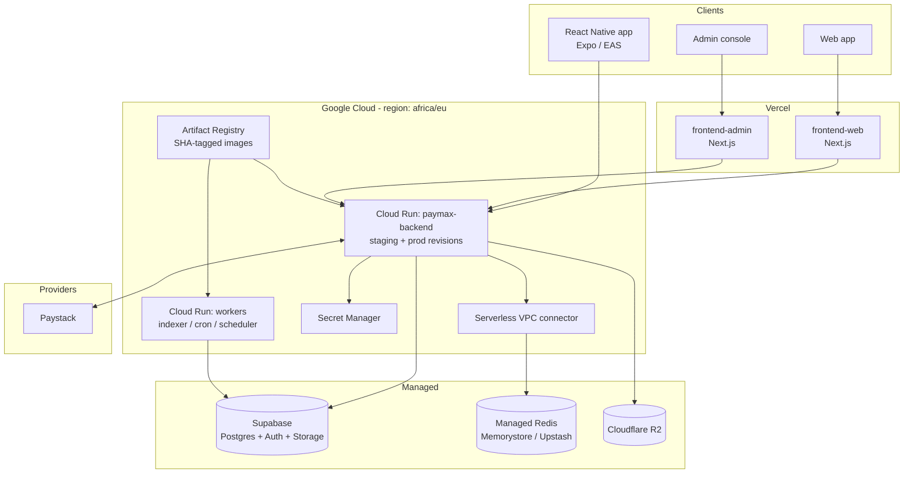

# Paymax × Spotlight — Super-App Launch Infrastructure Blueprint

> Status: proposed · Owner: Platform/DevOps · Last updated: 2026-08-02
> Decisions locked: **Backend → Google Cloud Run**, **Web → Vercel**, **Data → Supabase (managed Postgres)**.
> This document is the source of truth for how we ship, observe, and roll back the super-app. It complements `CLAUDE.md` (iron rules) and `docs/architecture/audit.md`.

---

## 1. Executive summary

We are turning a working monorepo (Go backend, two Next.js apps, a React Native app, Supabase, Redis) into a **launch-grade fintech platform**. The engineering is largely in place; the **delivery and operations layer is not**. This blueprint closes that gap with three principles:

1. **Build once, promote the same artifact** dev → staging → prod. Differences are config/secrets only.
2. **Every change is deployable, observable, and reversible in minutes.** Rollback is a first-class action, not a heroics exercise.
3. **Least privilege and auditability everywhere** — mandatory for a wallet/KYC/ledger system.

### Target architecture



---

## 2. Current-state assessment (2026-08-02)

| Area | Today | Gap for launch |
|---|---|---|
| CI gates | `ci.yml` (regression, money invariants, contract, tsc, lint, Go build/vet, migration guard, secret hygiene) + ~15 per-module lanes + reusable templates | No dependency/container/CodeQL scanning; no vuln gate |
| Backend deploy | `deploy.yml` is **100% `echo "TODO"` stubs** | No real artifact build/promote; no runtime |
| Web deploy | `deploy-cpanel.yml` → Namecheap/Passenger via SCP | Single node, no atomic deploy, no rollback, scaling ceiling |
| IaC | none | Infra is console/manual = snowflakes |
| Secrets | GitHub secrets + cPanel SSH | No central vault, no rotation, no OIDC-to-cloud |
| Migrations | `db push` in CI; local DB drifted 17 behind | No expand/contract prod gate; risky |
| Observability | none (web has Sentry dep) | No metrics/traces/uptime/alerting/error tracking end-to-end |
| Redis | local container only | No managed prod Redis |
| Mobile release | none | No EAS build/submit for app stores |
| DR | none | No tested backup/restore, no runbooks |

**Verdict:** strong app-layer, near-zero delivery/ops layer. This is a solvable, well-scoped launch program (§15).

---

## 3. Environments & promotion

Three environments, **one build artifact** promoted across them. Only config/secrets differ.

| Env | Purpose | Backend | Web | Data | Provider rails |
|---|---|---|---|---|---|
| **dev** | local + PR previews | docker-compose / Cloud Run PR preview | Vercel preview per PR | Supabase local / branch | Paystack **test** |
| **staging** | pre-prod verification | Cloud Run `paymax-backend` (staging) | Vercel preview→staging alias | Supabase staging project | Paystack **test/sandbox** |
| **prod** | live | Cloud Run `paymax-backend` (prod), min-instances ≥ 1 | Vercel production | Supabase prod project | Paystack **live** |

- **No env-specific builds.** The image tag is the commit SHA; the environment is selected by injected secrets/config (`RAILS_MODE=sandbox|live`, DB URL, Paystack keys).
- Prod is **human-gated** (GitHub Environment protection) and deploys via canary/blue-green.

---

## 4. Git & repository governance

- **Trunk-based with short-lived branches.** `main` is always releasable. Feature branches → PR → squash-merge. Conventional Commits (already in use).
- **Branch protection on `main`** (see `docs/launch/BRANCH-PROTECTION.md`): require PR, ≥1 review, **CODEOWNERS review for money/auth/infra paths**, all required checks green, linear history, no force-push, no direct pushes, signed commits (recommended).
- **CODEOWNERS** routes review of `backend/internal/finance/**`, `supabase/migrations/**`, `contracts/openapi.yaml`, `.github/**`, and `infra/**` to the right owners.
- **PR template** enforces the CLAUDE.md checklist (feature flag, tests-first for money path, migration additive-only, reviewer sign-off).
- **Protected-path hook** (already enforced by PreToolUse) keeps Spotlight legacy modules wrapped, not edited.
- **Secret scanning + push protection** on the GitHub repo; `gitleaks` in CI as defense-in-depth.
- **Dependabot** for npm, Go modules, GitHub Actions, and Docker base images.

> Note: the current git remote is `old-origin → paymax2022/spotlight-latest`. Confirm the canonical launch repo/org and set `origin` before wiring OIDC/Actions environments.

---

## 5. CI/CD pipeline

### Pipeline stages (single source of truth for "releasable")

```
install → lint → typecheck → unit tests (regression + money invariants)
  → build → integration tests (Postgres service) → security scan
  → publish image (Artifact Registry, SHA tag)
  → deploy staging → smoke test → [manual gate] → canary prod → health-gated promote
```

- **`ci.yml`** stays the always-on PR gate. **Add a security lane** (`security.yml`): CodeQL (Go + JS/TS), `govulncheck`, `gitleaks`, Trivy (image + filesystem), `npm audit`/`osv-scanner`. Block merge on high/critical.
- **Build once**: `deploy.yml` builds the backend image, tags it `:{sha}`, pushes to Artifact Registry, and the **same digest** is deployed to staging then prod.
- **Web**: `deploy-web.yml` deploys both Next apps to Vercel — preview on PR, production alias on `main`.
- Keep pipelines fast: dependency caching, path filters (per-module lanes already do this), parallel jobs, `concurrency` cancellation (already set).

### Rollback (must exist before first deploy)

- **Backend (Cloud Run):** revisions are immutable; roll back = shift 100% traffic to the previous healthy revision (`gcloud run services update-traffic … --to-revisions PREV=100`) — seconds, no rebuild. `deploy.yml` supports redeploying a prior SHA via `workflow_dispatch`.
- **Web (Vercel):** instant "Promote to Production" of a previous deployment.
- **DB:** never ship a destructive migration with the code that needs it (expand/contract, §10) so code rollback never strands the schema.

---

## 6. Cloud architecture (Cloud Run + Vercel)

### Backend — Google Cloud Run
- One service `paymax-backend` per environment; **container listens on `$PORT`** (Cloud Run injects it — align `cfg.Port`), **`/healthz`** liveness + **`/readyz`** readiness (added in this change).
- **Min instances ≥ 1 in prod** (avoid cold starts on the money path); autoscale on concurrency. Set CPU/memory requests, request timeout, and max instances.
- **Workers** (`marketplace-indexer`, `marketplace-cron`, `transport-scheduler`) run as separate Cloud Run services/jobs from the **same image** (command override) — "build once, deploy many," already how the Dockerfile is structured.
- **Egress to Redis/private resources** via a Serverless VPC connector. Managed Redis = **Memorystore** (same VPC) or **Upstash** (serverless, simplest).
- **Ingress**: allow-all for public API; put Cloud Armor / rate-limiting in front for prod; the app still enforces per-endpoint rate limits.

### Web — Vercel
- `frontend-web` and `frontend-admin` as two Vercel projects (monorepo root dirs). Preview deployments per PR; production on `main`.
- Env vars per Vercel environment; **server-only secrets never `NEXT_PUBLIC_`** (the `secret-hygiene` check + `check-client-secrets.sh` enforce this).
- Point the app's API base at the Cloud Run URL (custom domain) per environment.
- **Retire** `deploy-cpanel.yml` once Vercel is live (keep it one release cycle as fallback, then delete).

### Data & integrations
- **Supabase** stays the managed Postgres/Auth/Storage. Separate **projects** per env (never share a DB across envs). Money-path uses the pgx pool; Spotlight modules use Supabase REST (per CLAUDE.md).
- **Cloudflare R2** for object storage (already via presigned URLs).
- **Paystack** keys are per-env secrets; webhook HMAC verification already implemented — ensure the webhook URL points at the right env.

---

## 7. Infrastructure as Code (Terraform)

Everything above is declared in `infra/terraform/` (skeleton included in this change), applied via pipeline, reviewed via PR — never clicked.

- **State**: remote GCS backend, **one state per environment**, locking on.
- **Modules**: `cloud-run-service` (reused for backend + each worker), plus root config for Artifact Registry, Secret Manager, VPC connector, service accounts, and **Workload Identity Federation** (GitHub OIDC → GCP, no long-lived keys).
- **Tagging/labels**: `env`, `service`, `owner`, `cost-center` on every resource.
- **Promotion**: `terraform plan` on PR (comment the diff), `terraform apply` on merge, gated for prod.

See `infra/terraform/README.md` for the bootstrap order and the values you must supply (GCP project IDs, region, domains).

---

## 8. Backend production-readiness (money-path)

Enforced by CLAUDE.md + the backend-engineering discipline. Launch checklist:

- [ ] **Graceful shutdown** on SIGTERM (Cloud Run sends it before killing) — added in this change so in-flight requests/txns drain.
- [ ] **`/healthz`** (liveness, no deps) + **`/readyz`** (readiness: DB + Redis ping) — added in this change.
- [ ] **Idempotency-Key required** on every money mutation; balanced double-entry ledger; audit event; tier-limit fail-closed (iron rules — keep green via `test:money`).
- [ ] **Object-level authZ** on every protected route (not just route-level) — the highest-risk gap in most systems.
- [ ] **Structured logs** (JSON, request-id, actor) — no secrets/PII. **Immutable audit log** for decisions and sensitive changes.
- [ ] **Rate limiting** on abuse-prone/auth endpoints; timeouts, retries-with-backoff, and circuit breakers on provider calls (Paystack) so one slow dependency degrades gracefully.
- [ ] **State machines** (onboarding/KYC/payout/dispute) implemented as guarded transitions with atomic side effects + who/when — never ad-hoc status writes.
- [ ] **Config/schema-driven** variants (merchant types, KYC forms) validated against the exact submitted schema version.
- [ ] `go test -race`, `govulncheck`, and the per-module invariant suites green in CI.

---

## 9. Frontend production-readiness (web + admin + mobile)

- [ ] Every async read handles **loading / empty / partial / error / unauthorized** as real states (discriminated), not boolean tangles.
- [ ] **Server state vs client state** separated (React Query cache keys + invalidation) — the CORS/proxy work already exercises this layer.
- [ ] **Mutations guard in-flight** (no double-submit), define optimistic-update rollback; map server field errors back to the field.
- [ ] **Permission-gated affordances**; unauthorized / not-yet-KYC-approved are real screens with a next action (never blank/dead-end).
- [ ] Multi-step flows (onboarding, KYC, checkout) are **schema-driven wizards** with draft-resume, versioned schema validation, and upload-as-state-machine — not bespoke forms per type.
- [ ] Accessibility (labels, focus, keyboard) and responsive built in; heavy routes lazy-loaded; long lists virtualized.
- [ ] **No secrets in the client**; the API is the enforcement point (hiding a button is UX, not security).

---

## 10. Data & migrations (expand/contract)

- **Additive-only** is already enforced by the migration guard. For launch, formalize **expand/contract**:
  1. *Expand*: add columns/tables (nullable/defaulted), deploy.
  2. Deploy code that writes both old+new; backfill.
  3. Switch reads to new; deploy.
  4. *Contract*: remove old in a **later** release.
- **Never** run a destructive/locking migration in the same step as the code depending on it. Test migrations against **prod-like data volumes** (long locks = outages).
- Replace ad-hoc `supabase db push` in prod with a **gated migration job** in the deploy pipeline: dry-run/plan on PR, apply to staging automatically, apply to prod **before** the code that needs it, with a rollback/forward-fix plan recorded.
- Fix the current drift: keep local, staging, prod migration state reconciled (the recent 17-migration backlog must not recur — CI should diff applied-vs-files).

---

## 11. Observability & SLOs

**Three pillars on every service before it takes prod traffic.**

- **Errors**: Sentry (web already has the dep; add backend `sentry-go`). Release-tagged by commit SHA; source maps uploaded from Vercel.
- **Metrics**: golden signals per service — latency (p50/p95/p99), error rate, saturation, throughput. Cloud Run exposes these; export app metrics via OpenTelemetry → Cloud Monitoring (or Grafana Cloud).
- **Traces**: OpenTelemetry across web → backend → DB/provider, so a slow checkout is one trace, not four dashboards.
- **Uptime + synthetic**: external check on `/healthz` and a **money-path smoke** (e.g. sandbox payout round-trip) per env.
- **Deploy markers** on dashboards; alert on **symptoms users feel** (error rate, latency, failed payments) — every alert actionable, owned, and paging on user impact only.

### Starter SLOs (tune post-launch)
| Signal | Target |
|---|---|
| API availability (`/api/v1/*`) | 99.9% monthly |
| API latency p95 | < 400 ms |
| Payment/webhook success | > 99.5% (excl. provider-declines) |
| Wallet ledger invariant breaches | **0** (page immediately) |

---

## 12. Security & compliance (fintech / Nigeria)

- **Secrets** in Secret Manager; **CI→cloud auth via OIDC/Workload Identity** (no long-lived keys); rotate provider keys; scope every credential least-privilege.
- **Network**: private egress to DB/Redis; restrict ingress; WAF/Cloud Armor + bot/rate protection in front of prod.
- **Data**: encrypt at rest + in transit (managed defaults); documents behind signed URLs; **never log full PII/secrets**; unique KYC identifiers to block duplicate-identity abuse; gate capabilities on verification tier.
- **Auditability**: immutable audit log of money movements and admin decisions; audit trail of **deploys and infra changes** (who/what/when) — Terraform + Actions give this.
- **Compliance posture**: codify data residency (choose an Africa/EU region), retention, encryption, and access-review into infra/pipeline so it's enforced, not documented. Plan a third-party pen test and a Paystack/PCI-scope review before go-live.
- **Dependency & supply chain**: Dependabot + CodeQL + Trivy + `govulncheck`; pin base images; SBOM on release.

---

## 13. Disaster recovery & backups

- **Supabase**: enable PITR (point-in-time recovery) on the prod project; **test a restore** into a scratch project quarterly (an untested backup is a hope).
- **Redis**: treat as cache/queue — design so a flush is survivable; persist durable state in Postgres/ledger.
- **RTO/RPO targets** defined per data class; runbook for region/provider outage.
- **Infra**: Terraform makes the platform re-creatable; keep state backed up and locked.

---

## 14. Mobile release (Expo / EAS)

- Add **EAS Build + Submit** pipelines (iOS TestFlight, Android Play internal → production tracks), channel per env, OTA updates via EAS Update for JS-only fixes.
- Version/build-number automation tied to release tags; store metadata + privacy declarations prepared early (fintech review is slow).
- Point the app at the per-env Cloud Run API base; ship a kill-switch/feature-flag for risky money flows.

---

## 15. Phased rollout plan

### P0 — launch-blocking (this program)
1. **Git governance**: branch protection, CODEOWNERS, PR template, Dependabot, secret scanning. *(implemented in this change)*
2. **CI security lane**: CodeQL + govulncheck + gitleaks + Trivy + audit. *(implemented in this change)*
3. **Backend prod-readiness**: `/healthz`+`/readyz`, graceful shutdown, `$PORT`. *(implemented in this change)*
4. **IaC + real deploy**: Terraform skeleton; `deploy.yml` → Cloud Run (build-once, OIDC, staging→gate→prod); `deploy-web.yml` → Vercel. *(scaffolded in this change — fill GCP project values)*
5. **Managed Redis + Supabase staging/prod projects + Secret Manager** wired.
6. **Observability**: Sentry (web+backend), uptime on `/healthz`, one paging alert per service.
7. **Migration gate** in pipeline (expand/contract); reconcile env drift.

### P1 — hardening (first weeks)
- OpenTelemetry traces end-to-end; SLO dashboards + burn-rate alerts.
- Canary automation with auto-rollback on error-rate breach.
- Load test the money path at expected launch volume; tune min/max instances.
- DR restore drill; runbooks for top-5 incidents.
- EAS mobile pipeline to store tracks.

### P2 — scale & compliance
- Cost/perf tuning, autoscaling policies, read replicas if needed.
- Pen test remediation; formal access reviews; SBOM + release provenance.
- Multi-region / failover posture if growth demands.

### Go-live runbook (abridged)
1. Freeze; final green `ci.yml` + `security.yml` on `main`.
2. Apply prod Terraform; verify Secret Manager populated.
3. Migrate prod DB (expand) → deploy backend canary (10%) → watch golden signals 30 min → promote 100%.
4. Deploy web to Vercel prod; flip DNS/domains.
5. Smoke: auth, wallet fund (sandbox→live toggle), payout, webhook round-trip, KYC submit.
6. Announce; watch dashboards; keep prior revision warm for one-command rollback.

---

## 16. What this change delivers

- `docs/launch/SUPER-APP-LAUNCH-BLUEPRINT.md` — this document.
- `docs/launch/BRANCH-PROTECTION.md` — the ruleset + `gh` script to apply it.
- `.github/CODEOWNERS`, `.github/pull_request_template.md`, `.github/dependabot.yml`.
- `.github/workflows/security.yml` — CodeQL, govulncheck, gitleaks, Trivy, audit.
- `.github/workflows/deploy.yml` — **real** build-once → Artifact Registry → Cloud Run staging → gated prod (OIDC), replacing the TODO stubs.
- `.github/workflows/deploy-web.yml` — Vercel deploy for both Next apps.
- `infra/terraform/**` — Cloud Run + Artifact Registry + Secret Manager + WIF skeleton with a reusable `cloud-run-service` module and bootstrap README.
- Backend: `/healthz` + `/readyz` + graceful shutdown wired into `cmd/server`.

Everything cloud-specific that needs *your* values (GCP project IDs, region, Vercel/Sentry tokens, domains) is clearly marked `TODO(you)` / Terraform variables — no secrets are committed.
