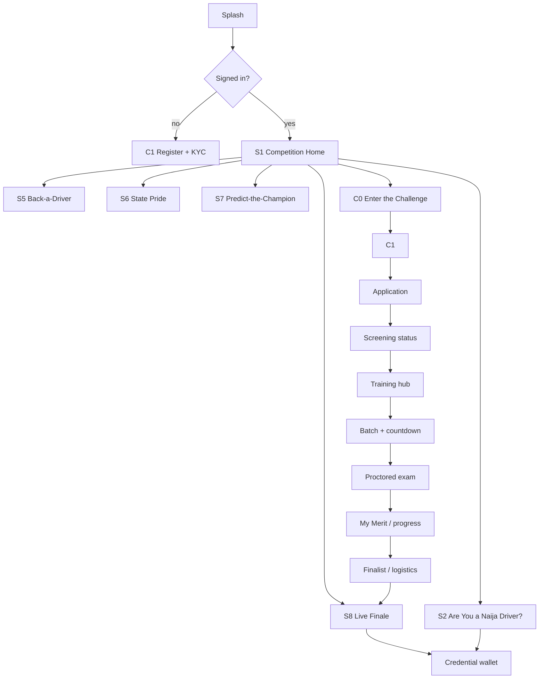

# Arena — UX Flows & Admin Console Workflows

**Instance: Naija Driver (Nigerian Drivers Challenge, Nov 2026)**
Companion to `ARENA-PRD.md`. This document is the build spec for the **mobile app screen flow** (Part A) and the **admin/operations console workflow** (Part B). Screen codes are stable references: `C#` contestant, `S#` spectator, `A#` admin. Every screen maps back to the PRD's lifecycle state machine (§8), rails (§3), and RBAC (§9).

**Reading convention for each screen:**
`CODE — Name` `[gate/state]` → **Purpose · Entry · Key UI · Primary actions · States (loading/empty/error/offline) · Exits**

---

# PART A — MOBILE APP

## A0. Personas & information architecture

One Paymax identity, two roles that can coexist: a user may **compete** and **spectate** in the same competition. Role is derived from state, not a separate account (NDC-3).

- **Contestant** — has a `contestant` record in the competition; sees the Compete tab.
- **Spectator** — any Paymax user; sees Watch/Play tabs. All contestants are also spectators.

**Global navigation (bottom tab bar):**

```
[ Watch ] [ Play ] [ Compete ] [ Wallet ] [ Me ]
   S-*      S-*       C-*        reuse     profile
```

- **Compete** tab is hidden until a user starts an application; once started it becomes the contestant's home and reflects their current lifecycle state.
- **Wallet** reuses the existing Paymax wallet UI (gifting, cashback, payouts) — not respecified here.
- Entry points into the competition: push notification, referral deep-link, Spotlight broadcast CTA, in-app banner.

**Navigation map (high level):**



## A1. Cross-cutting flows (apply to all screens)

**KYC / identity gate (reuse SSO + tiered KYC).**
Any action that writes money or creates a contestant requires the matching KYC tier (NDC-3). Flow: action tapped → tier check → if insufficient, route to KYC step-up (BVN/NIN) → on success, resume the original action idempotently. Never dead-end the user; always return them to intent.

**Wallet / gifting flow (reuse Connect).**
Support actions (S5) open the existing gift sheet: amount → confirm → wallet debit (append-only ledger entry, idempotent, NDC-4) → success animation → contribution attributed to contestant + pot. No new payment UI; only new attribution tags.

**Notifications (lifecycle-driven).**
Each guarded transition (PRD §8) fires a templated notification: screening decision, training unlocked, batch assigned, exam window opening (T-24h / T-1h), qualified/eliminated, finalist, crown result, credential issued. Deep-link straight to the relevant screen.

**Offline-first conventions (house pattern).**
Read screens cache last-known state and show a "last updated" stamp. Write actions queue when offline and replay with idempotency keys on reconnect. The **proctored exam (C6) is the exception** — it requires a live connection and a stable-session guard; a dropped connection pauses the timer per proctor policy and resumes on the same signed session.

**Standard screen states.**
Every screen defines: *loading* (skeleton), *empty* (pre-state guidance + single CTA), *error* (retry + support link), *offline* (cached + banner). Called out per screen only where non-obvious.

---

## A2. Contestant journey (screen-by-screen)

Each contestant screen is gated by lifecycle state — the Compete tab **renders the screen matching the current state** and shows a persistent progress stepper (`Applied → Screened → Trained → Theory → Qualified → Finalist → Crowned`).

**C0 — Enter the Challenge** `[gate: none]`
- **Purpose:** convert a spectator into an applicant.
- **Entry:** Home CTA, banner, referral link.
- **Key UI:** value prop, eligibility summary, prize + credential explainer, "Start application."
- **Actions:** Start → C1.
- **Exits:** → C1 (start) · back → Home.

**C1 — Register / KYC (BVN/NIN)** `[gate: auth + KYC tier]`
- **Purpose:** establish verified identity (NDC-3).
- **Entry:** C0, or any gated action.
- **Key UI:** phone/OTP (reuse SSO), BVN/NIN capture, consent checkboxes (data + telematics-later opt-in placeholder).
- **Actions:** Verify → creates/updates Paymax user + KYC tier.
- **States:** error → clear field-level messages; verification pending → status view.
- **Exits:** → C2 on success.

**C2 — Application form** `[state: APPLIED created on submit]`
- **Purpose:** capture the application (versioned schema, §10).
- **Key UI:** dynamic form rendered from `application_schema_version`; home-state (36+FCT) selector; document upload (license) to signed storage; save-draft.
- **Actions:** Save draft · Submit → creates `contestant(state=APPLIED)` + `application(review_state=SUBMITTED)`.
- **States:** offline → draft queued; validation errors inline.
- **Exits:** → C3.

**C3 — Screening status** `[state: APPLIED → SCREENED | REJECTED]`
- **Purpose:** show review progress and outcome.
- **Key UI:** status card (Submitted / Under review / Needs more info / Approved / Rejected), reason on terminal, resubmit affordance on NEEDS_MORE_INFO.
- **Actions:** Provide more info (loops to reviewer) · Continue on approval.
- **Exits:** approved → C4 · rejected → terminal screen with re-entry info · info-needed → C2 (scoped).

**C4 — Training hub** `[state: SCREENED → TRAINED]`
- **Purpose:** deliver the safety curriculum (Spotlight content) — the education payload.
- **Key UI:** modules (theory, hazard perception, crash-site/golden-seconds first-aid), progress bars, completion gates, downloadable-for-offline lessons.
- **Actions:** Complete modules → on threshold, transition to TRAINED (unlocks exam assignment).
- **States:** offline → cached lessons playable; progress syncs later.
- **Exits:** → C5 when training complete.

**C5 — Exam-batch assignment + countdown** `[state: THEORY_ASSIGNED]`
- **Purpose:** tell the contestant their batch (7/14/21 Nov) and prep them.
- **Key UI:** assigned batch date/time, device/connection check, proctoring requirements (camera/ID), rules, T-minus countdown, "Enter exam" (disabled until window).
- **Actions:** Run readiness check · Enter exam (in-window only).
- **Exits:** → C6 at window open.

**C6 — Proctored exam runner** `[state: THEORY_ASSIGNED → THEORY_TAKEN]`
- **Purpose:** deliver the timed, proctored theory exam feeding signed Merit (NDC-2).
- **Key UI:** one-question-at-a-time, timer, item navigator, proctor attestation active (camera), autosave per answer, submit.
- **Actions:** Answer · Submit → `TheoryExamAdapter` produces a signed `merit_entry`.
- **States:** **online-required**; connection drop → guarded pause/resume on same session; single attempt per (contestant, batch).
- **Exits:** → C7 (result pending → resolved).

**C7 — My Merit / stage progress** `[state: THEORY_TAKEN → QUALIFIED | ELIMINATED]`
- **Purpose:** the contestant's private dashboard.
- **Key UI:** own Merit entries by stage (read-only), qualification cutoff + where they stand, next-stage guidance; public leaderboard link. **No money/engagement tallies shown as affecting standing** (reinforces NDC-1 to the user).
- **Actions:** View public leaderboard · Share progress.
- **Exits:** qualified → C8 · eliminated → terminal (with credential if earned) · else stay.

**C8 — Finalist / finale logistics** `[state: FINALIST]`
- **Purpose:** everything for the Lagos grand finale (28 Nov).
- **Key UI:** venue, schedule, check-in QR, practical + first-aid assessment format, travel/accommodation info, live-stream link.
- **Actions:** Confirm attendance · Check-in (QR at venue).
- **Exits:** → Live Finale (S8) as participant · → C9 after result.

**C9 — Credential wallet** `[state: any; issued from Merit]`
- **Purpose:** hold verifiable credentials — **Certified Safe Driver** and, if won, **Naija Driver** (NDC-7).
- **Key UI:** credential cards with verify-QR/hash, issue date, tier, status (Active/Revoked); "what this unlocks" (transport onboarding, insurance discount, fleet trust).
- **Actions:** Share/verify credential · Deep-link into transport/insurance offers (Phase 4 hooks).
- **Exits:** → cross-vertical offers.

---

## A3. Spectator journey (screen-by-screen)

Available to everyone from day one — this is the top-of-funnel and the social-impact engine.

**S1 — Competition home / live leaderboard** `[gate: none for viewing]`
- **Purpose:** the pulse of the competition.
- **Key UI:** live **Merit** leaderboard (the real ranking), countdown to next event, featured drivers, State Pride snapshot, Play/Support/Predict CTAs, Spotlight content feed, sponsor slots (Featured Placement).
- **Actions:** Navigate to any rail · Become a contestant (C0).
- **States:** offline → cached leaderboard + stamp.
- **Exits:** → S2/S5/S6/S7/S8/C0.

**S2 — "Are You a Naija Driver?" quiz (Play-Along)** `[gate: light — Paymax login]`
- **Purpose:** free gamified quiz using the **same content contestants take** — trains the public (Rail 3).
- **Key UI:** category picker (theory / hazard perception / first-aid), timed questions, streak counter, progress.
- **Actions:** Play round → writes `engagement_event`; on threshold triggers credential issuance.
- **States:** offline → queue attempt; rate-limited on cashback.
- **Exits:** → S3.

**S3 — Quiz results + Certified Safe Driver badge** `[gate: none]`
- **Purpose:** reward and reinforce learning.
- **Key UI:** score, correct-answer explainers (the teaching moment), badge earned, cashback credited (small, ledgered), share card, "test a friend" referral.
- **Actions:** Share · Claim badge/credential · Replay.
- **Exits:** → C9 (credential) · → S5 (back a driver) · referral out.

**S4 — Driver profile** `[gate: none]`
- **Purpose:** a single contestant's public page (the object of Support/Predict).
- **Key UI:** driver bio, home state, public Merit standing, support total (People's Champion tally, clearly labelled as separate from Merit), back/predict CTAs.
- **Actions:** Back this driver (→S5) · Predict (→S7) · Follow.
- **Exits:** → S5 / S7.

**S5 — Back-a-Driver / "Fuel My Journey" (Support)** `[gate: KYC tier + wallet]`
- **Purpose:** real-Naira backing (Rail 2, reuse gifting).
- **Key UI:** contestant context, amount presets/custom, split explainer (pot vs People's Champion), transparency note: *"Support fuels the prize pot and the People's Champion award. It does not affect judging or the crown"* (surface NDC-1 to the user).
- **Actions:** Confirm gift → wallet ledger entry (idempotent) → pot + tally update.
- **States:** insufficient KYC → step-up; insufficient balance → top-up flow.
- **Exits:** → success → S4 / S1.

**S6 — State Pride leaderboard** `[gate: none for view]`
- **Purpose:** 36 states + FCT competing on aggregate support — regional identity as fuel.
- **Key UI:** state ranking, your-state highlight, contribution breakdown, "rep your state" share.
- **Actions:** Back your state's drivers (→S5) · Share.
- **Exits:** → S5.

**S7 — Predict-the-Champion** `[gate: light]`
- **Purpose:** fantasy layer to retain audience across all four Saturdays.
- **Key UI:** pick drivers to advance per stage, prediction points, prediction leaderboard, lock deadlines per event.
- **Actions:** Submit picks → `engagement_event`; points accrue as picks advance.
- **Exits:** → S1 · results after each event.

**S8 — Live finale stream + live gifting** `[gate: none to watch; KYC for gifting]`
- **Purpose:** the 28 Nov convergence moment (reuse LiveKit + LL-HLS + Streaming Gateway).
- **Key UI:** low-latency stream, live **Merit** reveal overlay, **live gifting** rail with on-screen People's Champion ticker, sponsor overlays, reactions/chat, PPV/free gate per config.
- **Actions:** Watch · Gift live (→ pot + tally) · React.
- **States:** adaptive bitrate; offline → "resume when back online."
- **Exits:** → S9 (pot) · → C9 (credential drop for certified spectators).

**S9 — Prize-pot transparency view** `[gate: none]`
- **Purpose:** trust surface — show the money is clean (supports NDC-6).
- **Key UI:** live derived pot total, contribution history (aggregated), declared split formula, disbursement status post-event.
- **Actions:** View history · Verify.
- **Exits:** → S1.

---

# PART B — ADMIN / OPERATIONS CONSOLE

## B0. Console personas & access (RBAC recap, PRD §9)

Web console, role-scoped, object-level authorization on every action. No client-trusted roles.

| Console | Primary role | Guarded writes |
|---|---|---|
| A1 Competition config | Competition Admin | config publish (versioned) |
| A2 Screening review queue | Reviewer | screening decisions (transition) |
| A3 Proctor console | Proctor | attest theory sessions |
| A4 Judge console | Judge | submit practical/first-aid scores |
| A5 Lifecycle transition | Competition Admin | guarded state transitions |
| A6 Merit ledger + audit viewer | Auditor (read) / Admin | none (read/verify only) |
| A7 Pot & disbursement | Competition Admin (+ approver) | disbursement (multi-approve) |
| A8 Sponsor / Featured Placement | Competition Admin | sponsor slot config |
| A9 Credential issuance/revocation | Competition Admin | issue/revoke (from Merit) |

Every console action writes an immutable `audit_log` row (actor, entity, before/after, timestamp).

## B1. Console-by-console workflow

**A1 — Competition config**
- **Who:** Competition Admin.
- **Workflow:** create/edit competition → configure **rails** (Merit sources, Support params, Play-Along thresholds, Sponsor slots) → define **awards** and their rail bindings (crown←Merit only; People's Champion←Support; etc.) → set **eligibility** + **rubric/exam/screening schema versions** → validate → **publish** (creates immutable `config_version`).
- **Guards:** publish is versioned and audited; a live competition's award-rail bindings for the crown are locked to Merit (NDC-1) and cannot be edited to accept other rails.
- **Output:** an immutable, referenceable competition configuration.

**A2 — Screening review queue** `[transition: APPLIED → SCREENED | NEEDS_MORE_INFO | REJECTED]`
- **Who:** Reviewer (own queue only).
- **Workflow:** open queue (filter by batch/state/flag) → open application → review payload + docs (signed-URL) against screening rubric → decide: Approve / Request info / Reject (reason required).
- **Guards:** object-level scope (only assigned queue); decision is a guarded transition with atomic side effects (approve → TRAINED-eligible, notify, audit).
- **Output:** cohort screened; contestants advanced or looped.

**A3 — Proctor console** `[feeds Merit via TheoryExamAdapter]`
- **Who:** Proctor (assigned batch only).
- **Workflow:** monitor active exam sessions (7/14/21 Nov) → view live attestation feeds → flag/pause/resume per policy on connection or integrity events → submit session attestation → adapter signs `merit_entry`.
- **Guards:** one attempt per (contestant, batch); attestation is a signed field on the Merit entry; proctor identity recorded.
- **Output:** signed theory Merit entries.

**A4 — Judge console** `[feeds Merit via PracticalJudgeAdapter / FirstAidAdapter]`
- **Who:** Judge (finale only).
- **Workflow:** at Lagos finale, open assigned contestant → score against published practical + crash-site/first-aid rubric (rubric_version pinned) → submit → adapter aggregates across judges (trimmed mean) and signs.
- **Guards:** judge can only score assigned contestants; each judge's raw score retained for audit; aggregation deterministic.
- **Output:** signed practical + first-aid Merit entries.

**A5 — Lifecycle transition console** `[all guarded transitions, PRD §8]`
- **Who:** Competition Admin.
- **Workflow:** view contestants by state → run stage transitions that read **only** the Merit leaderboard: compute theory cutoff → **QUALIFIED**; select top-N → **FINALIST**; finalize finale → **CROWNED/ELIMINATED**. Manual `WITHDRAWN` with reason where needed.
- **Guards:** only allowed transitions offered; advancement reads Merit only (NDC-1); each transition atomic (crown → issue credential + finalize award + trigger disbursement, all-or-nothing); actor+reason audited.
- **Output:** contestants advanced; crown finalized.

**A6 — Merit ledger + integrity/audit viewer** `[read/verify only]`
- **Who:** Auditor (read), Admin.
- **Workflow:** browse Merit entries by contestant/stage → verify signatures + chain integrity → view compensating corrections → export for FRSC/regulator.
- **Guards:** no write path; verification runs the same public integrity proof.
- **Output:** provable, exportable audit trail (NDC-6).

**A7 — Pot & disbursement approvals** `[reuse payout rails; guarded PotDisbursement]`
- **Who:** Competition Admin + second approver.
- **Workflow:** view derived pot total + contribution ledger → define disbursement per published split (crown prize, People's Champion, scholarships) → **multi-approve** → execute via existing payout rails (idempotent) → publish disbursement status to S9.
- **Guards:** multi-signature approval; amounts reconcile against derived pot; every movement ledgered + audited (NDC-4).
- **Output:** transparent, disbursed prize pot.

**A8 — Sponsor / Featured Placement manager** `[reuse paid-promotion]`
- **Who:** Competition Admin.
- **Workflow:** onboard sponsor → configure branded challenges/badges + placement slots (home, driver profiles, finale overlays) → schedule → monitor delivery/impressions.
- **Guards:** Sponsor rail cannot bind to Merit awards (NDC-1); placements audited.
- **Output:** monetized sponsor visibility.

**A9 — Credential issuance / revocation** `[CredentialService, from Merit]`
- **Who:** Competition Admin.
- **Workflow:** auto-issue on qualifying transitions (Certified Safe Driver on Play-Along threshold; Naija Driver on crown) → manual revoke with reason if integrity issue → view verification logs.
- **Guards:** issuance only from Merit-derived state; independently revocable without touching unrelated Paymax capabilities (NDC-7); audited.
- **Output:** live, verifiable credential registry — the durable asset.

## B2. End-to-end operational runbooks (span consoles)

**R1 — Run a theory batch (7/14/21 Nov).**
A5 confirm THEORY_ASSIGNED cohort for the batch → contestants sit exam (C6) → A3 proctors attest → signed Merit lands (A6 verify) → A5 apply cutoff → QUALIFIED/ELIMINATED → notifications fire.

**R2 — Screen the applicant pool (October).**
A1 publish config + schemas → applications arrive (C2) → A2 reviewers clear queues → approved → TRAINED-eligible → training (C4) → ready for R1.

**R3 — Execute the finale & crown (28 Nov).**
A8 sponsor overlays live → S8 stream + live gifting running → A4 judges score practical + first-aid → A6 verify signed Merit → A5 finalize → **CROWNED** (atomic: A9 issues Naija Driver credential + award finalized + A7 disbursement triggered) → S1/S9 reflect result → public integrity proof available.

**R4 — Disburse the pot (post-finale).**
A7 reconcile derived pot → define split per published formula → multi-approve → execute payouts → S9 shows disbursed status → A6 audit export.

**R5 — Activate the registry (Phase 4).**
A9 credential registry live → transport onboarding, insurance pricing, and fleet-trust integrations consume verified credentials → optional telematics (adapter) and golden-seconds responder network switched on.

---

*All screens and consoles inherit the standard state/authz/idempotency/audit conventions from `ARENA-PRD.md`. Screen codes here are the canonical references for design and engineering tickets.*
