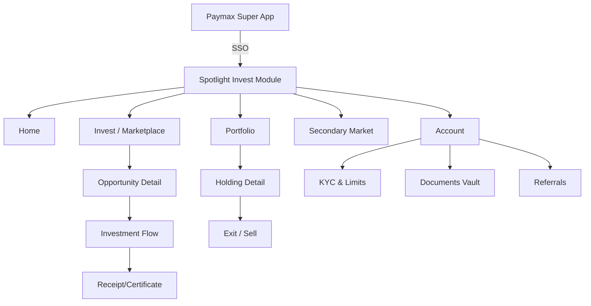
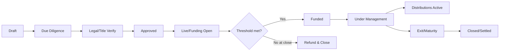

# Product Requirements Document (PRD)
## Spotlight × Paymax — Fractional Real Estate & Land Crowd-Investing Module
### Investor Mobile App + Admin Management Console

| Field | Value |
|---|---|
| Product | Fractional Real Estate / Land Crowd-Investing module ("Spotlight Invest") |
| Host platform | Paymax super app (shared auth, RBAC, wallet, KYC) |
| Surfaces | (1) Investor mobile app module, (2) Web admin management console |
| Primary market | Nigeria (Lagos-first), with diaspora/FX track |
| Document status | Draft v1.0 — for product, engineering, legal & compliance review |
| Author | Product Strategy |

> **Reading guide.** Sections 1–7 set strategy, model, personas and compliance constraints. **Section 8 (mobile app screens)** and **Section 9 (admin console screens)** are the core deliverable — a screen-by-screen inventory. **Section 10** gives end-to-end UX workflows. Sections 11–14 cover integration, NFRs, roadmap and open questions.

---

## 1. Executive Summary

Spotlight Invest lets Paymax users buy fractions of vetted, income-generating real estate and verified land from inside the super app, using their existing identity, KYC and wallet — no separate signup, no separate balance. Investors browse curated opportunities, invest from a low minimum (target ₦10,000), receive periodic rental/profit distributions straight to their Paymax wallet, track a live portfolio, and exit either at maturity or via an in-app **secondary market** (the category's biggest unmet need: liquidity).

The admin console is the operational backbone: asset onboarding with title due-diligence, funding-round management, an auditable cap table, a maker-checker distribution engine, KYC/compliance queues that enforce the SEC retail cap, and immutable audit logs — all governed by roles that slot into the super app's existing RBAC engine.

**The wedge:** trust-structured fractional ownership of income properties (the proven, compliant Nigerian model), launched to an existing super-app user base with an embedded wallet — a distribution and trust advantage standalone competitors (Keble, Fragvest, Coreum, Cribstock, Risevest) cannot match.

**Biggest risk:** regulatory classification (collective-investment-scheme / crowdfunding portal licensing) and land-title fraud. Both are treated as first-class, launch-gating constraints, not features.

---

## 2. Market & Competitive Context (researched)

Fractional real-estate investing is an established, fast-growing category in Nigeria. Verified comparable platforms and their patterns:

| Platform | Min. ticket | Model | Liquidity | Notable |
|---|---|---|---|---|
| **Keble** | ~₦10,000 / $10 | Fractional + full ownership + land; NG/UK/UAE/US | Hold to maturity/exit | Meristem Trustees, AXA Mansard insurance, Deloitte/EY audits, Deed of Assignment, ~5% listing acceptance |
| **Fragvest** | ₦20,000 | "Frags" under a real-estate trust; premium NG property | **Continuous secondary market** | Real-time tracking, monthly payouts, 15–24% ROI target |
| **Coreum** | Low | Fractional, multi-asset across Africa | Hold | FBNQuest Trustees custody |
| **Cribstock** | ₦50,000 | Fractional rental; held in trust | 5-year hold | ~10% p.a., monthly rent |
| **Risevest** | $10 | US real estate; 10,000 units/property at $10 | Hold | Goals + auto-invest, USD denomination |
| **WealthNG** | Low | Fractional property + REITs (NG) | Varies | ~18.7% fractional |
| **OwnJointly / STOW** | ₦10,000+ | Co-ownership / home-purchase plans | Hold | Cooperative & home-purchase angles |

**Where the market converges:** trust-based custody (a licensed trustee holds the asset; investors hold beneficial units), low entry tickets, monthly rental distributions, projected double-digit yields, professional management, and insurance.

**White space Spotlight can own:**
1. **Liquidity** — most platforms lock investors to maturity; only Fragvest offers true continuous resale. A robust secondary market + optional buyback pool is a differentiator.
2. **Embedded wallet & instant settlement** — competitors bolt on payments; Paymax *is* the rail. Zero-friction top-up, payout, reinvest.
3. **Title trust** — verifiable title status (registry/blockchain-anchored, geospatial) attacks the #1 fear in Nigerian land.
4. **Distribution** — an existing, KYC'd super-app user base = near-zero CAC vs. competitors' paid acquisition.
5. **Cultural fit** — group/syndicate investing (ajo/esusu pattern) and goal-based "save-to-own".

---

## 3. Regulatory & Compliance Constraints (researched — product-shaping)

These are not legal advice; they are design constraints to confirm with counsel and the SEC.

- **Crowdfunding is regulated** by the SEC under the Crowdfunding Rules 2021, continued and reinforced under the **Investment and Securities Act (ISA) 2025**. Investment-based crowdfunding (offering shares/debt/instruments to the public online) must run through a **registered Crowdfunding Portal/Intermediary** (paid-up capital requirement ₦100M; principal officers registered). **Implication:** Spotlight must either obtain the licence or partner with/operate via a licensed intermediary/trustee (the Keble/Coreum pattern — Meristem, FBNQuest).
- **Retail investor cap:** a retail investor may invest **no more than 10% of their net annual income per calendar year** across crowdfunding platforms. HNI / qualified institutional investors are exempt. **Implication:** the app must capture declared income, classify investor type, and **enforce the 10% cap in real time** at the point of investment, platform-wide.
- **Issuer/raise caps:** per-issuer 12-month limits (≈₦50M micro / ₦70M small / ₦100M medium; commodities platforms up to ₦1B). **Implication:** structure each raise to a specific, identified asset/SPV/trust; size rounds within caps.
- **No blind pools / fund-of-funds:** entities raising to "provide loans or invest in other entities," or with opaque ownership, are prohibited fundraisers. **Implication:** every raise must map to a **named, identified asset** with disclosed beneficial ownership — no generic "real estate fund" pool.
- **Offer window:** an offer may stay open up to **60 days (+30 extension)**; funds release only if the **minimum threshold** is met, else investors are refunded. **Implication:** rounds need timers, min-threshold logic, and automated refunds.
- **Mandatory risk disclosure:** prominent risk warnings on home/landing/subscription screens; a **signed risk-acknowledgement** per investor and per offer before any commitment.
- **Title & land:** Land Use Act regime — Certificate of Occupancy (C of O), Governor's consent, registered Deed of Assignment; high fraud surface (double-selling, family-land/"omonile" disputes). **Implication:** a formal title due-diligence workflow and an investor-visible **title-verification badge** + document vault.
- **AML/KYC & data:** BVN/NIN-backed KYC, sanctions screening, NDPR data-protection compliance. **Implication:** reuse the super app's KYC, add step-up where investment tiers demand it.
- **Sharia-compliant variant:** optionally offer non-interest (ijara/musharaka-style) structures for relevant investors — flagged as a Phase 2 track.

---

## 4. Chosen Business / Ownership Model

**Primary model — Trust-based fractional ownership (beneficial units).** Each asset is held by a registered **trustee** (independent custodian). Investors purchase **beneficial units ("Spots")** in that specific asset and receive a proportional share of rental income and appreciation; a registered Deed/declaration of trust evidences ownership. This is the proven, compliant Nigerian pattern and avoids the blind-pool prohibition because each raise is tied to one named asset.

**Supported instrument types (each a distinct opportunity category):**
1. **Income property (equity/units)** — built, rented assets; monthly/quarterly distributions + appreciation.
2. **Development financing (debt instrument)** — fixed-return note to fund a vetted developer; often a simpler regulatory path; fixed tenor.
3. **Land co-ownership** — verified-title plots; appreciation-led; strongest title-assurance requirements.
4. **REIT-feeder** *(Phase 2)* — access to listed/structured REIT units for diversification & liquidity.
5. **Sharia-compliant** *(Phase 2)* — non-interest structures.

**Money flow:** investor wallet → escrow (per round) → on success, to trustee/asset → operations generate income → distribution engine pays pro-rata back to investor wallets (net of fees & withholding tax). On under-subscription, escrow auto-refunds.

**Monetization:** management fee (% AUM), sourcing/listing fee from sponsors, secondary-market transaction fee (spread/flat), optional performance fee on appreciation at exit, FX spread on USD assets.

---

## 5. Personas & Roles (RBAC — slots into existing engine)

### 5.1 Investor-side personas
- **Mass-retail saver** — small tickets, goal-driven, mobile-first, low financial literacy; needs guardrails and education.
- **Affluent retail / professional** — larger tickets, diversification, secondary-market active.
- **HNI / qualified investor** — exempt from cap, larger allocations, wants data depth.
- **Diaspora investor** — FX/remittance-funded, remote KYC, "invest back home."

### 5.2 Admin / back-office roles (with segregation of duties)

| Role | Core capability | Sensitive permissions | SoD rule |
|---|---|---|---|
| Super Admin | System config, role assignment | Fee config, integrations | Cannot also approve payouts they configured |
| Compliance/KYC Officer | Approve/reject KYC; monitor limits | Override limit (logged), file SEC reports | Cannot onboard assets |
| Asset Manager | Onboard & manage assets | Advance asset lifecycle | Cannot approve own asset's payouts |
| Legal/Title Verifier | Verify title, sign off DD | Mark asset "title-clear" | Independent of Asset Manager |
| Finance/Treasury | Run distributions, reconcile escrow | Initiate disbursements | Maker only; needs checker |
| Distribution Approver | Approve payout runs | Release funds | Cannot be the run's maker |
| Sponsor/Developer (external) | Submit & track own assets | Scoped to own portfolio | Read-only on others |
| Support Agent | Tickets, read investor data | No money movement | — |
| Auditor | Read-only everything incl. logs | No writes | — |
| Marketing/Content | Manage learn hub, promos, campaigns | Publish content | No financial/PII write |

---

## 6. Information Architecture & Navigation

### 6.1 Mobile app — primary navigation (bottom tab bar)
1. **Home** (dashboard) · 2. **Invest** (discovery/marketplace) · 3. **Portfolio** · 4. **Market** (secondary market) · 5. **Account**
Global elements: notifications bell, search, support entry, KYC/limit status banner.

### 6.2 Admin console — left-nav sections
Dashboard · Assets · Funding Rounds · Cap Table · Investors · KYC & Compliance · Distributions · Secondary Market · Sponsors · Finance/Treasury · Documents · Reporting · Content · Settings & RBAC · Audit Logs · Support.

### 6.3 Sitemap (high level)

---

## 7. Asset Lifecycle (shared state model)

This lifecycle drives both surfaces: investor screens show only `Live`, `Funded`, `Under Management`, `Exited`; admin screens manage every state with role-gated transitions.

---

## 8. MOBILE APP — Detailed Screen Inventory

Format per screen: **purpose · key components · primary actions · states · reuse/RBAC notes.** Reuse tag: 🟢 reuse super-app, 🟡 extend, 🔵 new.

### 8.A Onboarding, Auth & KYC

**8.A.1 Module entry / splash** 🟢
Purpose: enter Spotlight from the super-app launcher. Components: brand splash, value strip, mandatory risk-disclosure ribbon. Actions: continue. States: first-time vs returning. Notes: no login screen — inherits super-app session (SSO).

**8.A.2 Welcome / value carousel (first-time only)** 🔵
Purpose: explain fractional ownership in 3–4 slides (own a slice, earn rent, sell anytime). Components: illustrated slides, "How it works," "Risks" link. Actions: Get started, Skip. States: first-run only.

**8.A.3 Investor activation & consent** 🔵
Purpose: convert a super-app user into an investor. Components: T&Cs, investment risk disclosure, data-use consent, e-signature/checkbox. Actions: Accept & continue. States: pending/accepted. Notes: gates all investing.

**8.A.4 KYC status & step-up** 🟡
Purpose: confirm KYC tier; request step-up if investment tier requires more (e.g., proof of address, higher-tier ID). Components: current tier badge, missing-items checklist, upload (ID, selfie/liveness, address), BVN/NIN confirm. Actions: upload, submit. States: verified / pending review / rejected / step-up required. Notes: reuses super-app KYC store; only collects deltas.

**8.A.5 Investor suitability & income declaration** 🔵
Purpose: risk profiling + capture **net annual income** to compute the 10% cap; classify investor type (retail / HNI / qualified). Components: short questionnaire, income input, optional HNI evidence upload. Actions: submit. States: complete / needs evidence. Notes: drives real-time limit enforcement.

**8.A.6 Risk acknowledgement (master)** 🔵
Purpose: regulatory signed acknowledgement that investments are speculative/high-risk. Components: disclosure text, scroll-to-end gate, e-sign. Actions: I acknowledge. States: signed/unsigned. Notes: timestamped, stored in vault; re-prompted per offer.

**8.A.7 Goal setup (optional)** 🔵
Purpose: personalize (e.g., "₦2M for school fees in 24 months"). Components: goal name, target, horizon, suggested allocation. Actions: create goal / skip. States: none/active.

**8.A.8 Onboarding success** 🔵
Components: confirmation, "Explore opportunities" CTA, starter education nudge.

### 8.B Home / Dashboard

**8.B.1 Home** 🔵
Purpose: at-a-glance hub. Components: portfolio value + today's change, wallet balance (🟢), next payout countdown, "Featured opportunities" carousel, quick actions (Invest, Top-up, Refer, Learn), goals progress, KYC/limit banner if incomplete. Actions: tap-through to any module. States: new user (empty, education-led) vs active (data-rich). Notes: home must surface the risk-disclosure ribbon per rules.

**8.B.2 Notifications center** 🟡
Purpose: payouts, round-closing alerts, KYC updates, price/secondary-market alerts, asset updates. Components: filterable list, read/unread. Actions: open item, mark read. Notes: reuses super-app notification service with module channel.

**8.B.3 Global search** 🔵
Purpose: find assets by name/location/type. Components: search bar, recent, suggested filters. Actions: search → results.

### 8.C Invest / Discovery (Marketplace)

**8.C.1 Opportunity list** 🔵
Purpose: browse all open opportunities. Components: cards (image, name, location, asset type, projected yield, tenor, risk band, funding progress bar, min ticket, currency NGN/USD), sort & filter (type, location, yield, tenor, risk, currency, funding status, Sharia-compliant), tabs by category. Actions: filter, open detail, save/watch. States: results / empty / loading / error.

**8.C.2 Map view** 🔵
Purpose: geospatial discovery (esp. land). Components: pins by asset, cluster, filter chips, card preview on tap. Actions: pan/zoom, open detail. Notes: supports title/geo-verification overlay.

**8.C.3 Category landing** 🔵
Purpose: curated views — Income Property, Development (Debt), Land, Diaspora/USD, Sharia. Components: category explainer + filtered list.

**8.C.4 Opportunity detail** 🔵 *(critical screen)*
Purpose: full decision context for one asset. Components (sectioned/tabbed):
- *Header:* image gallery / virtual tour, name, location, asset type, status, **title-verified badge**, watch/share.
- *Returns:* projected yield, distribution cadence, tenor, appreciation estimate, historical performance (if any), **returns calculator** entry.
- *Funding:* progress (raised/target), min threshold, unit price, units left, **offer countdown timer**, min/max ticket.
- *The asset:* description, specs, photos, map, sponsor/developer profile + track record, management plan, insurance.
- *Risk:* risk band + plain-language risk factors, liquidity terms, exit options.
- *Documents:* trust deed, valuation report, title docs (C of O/Deed), prospectus/offer memo, floor plans — open in viewer.
- *FAQ.*
Actions: **Invest now**, Calculate returns, Save, Share, Ask a question, Download docs. States: live / funding-closing-soon / fully funded (waitlist) / closed. Notes: prominent risk warning per SEC rules.

**8.C.5 Document viewer** 🟡
Purpose: read/download legal & asset docs. Components: PDF viewer, download, share. Notes: reuse super-app document storage.

**8.C.6 Returns calculator / simulator** 🔵
Purpose: "if I invest ₦X for Y months…" projection. Components: amount slider, tenor, projected income + appreciation, disclaimer. Actions: adjust, proceed to invest.

**8.C.7 Compare opportunities** 🔵
Purpose: side-by-side of 2–3 saved assets (yield, tenor, risk, ticket, liquidity).

**8.C.8 Watchlist** 🔵
Purpose: saved opportunities + alerts (closing soon, new units).

### 8.D Investment Flow

**8.D.1 Choose amount / units** 🔵
Components: unit price, quantity stepper or amount input, live "you'll own X% / N units", projected income, min/max guardrails. Actions: continue. States: within limit / exceeds offer cap.

**8.D.2 Investment-limit check** 🔵 *(compliance-critical)*
Purpose: enforce the 10%-of-income retail cap platform-wide in real time. Components: remaining annual allowance, this-order impact, block + explainer if exceeded (with HNI-upgrade path). Actions: adjust amount / upgrade classification / cancel. States: pass / soft-warn / hard-block.

**8.D.3 Order summary & fees** 🔵
Components: asset, units, amount, fees breakdown, net, payment source selector (wallet 🟢 / top-up / card / transfer), wallet balance check. Actions: continue.

**8.D.4 Wallet top-up (conditional)** 🟢
Purpose: fund wallet if insufficient. Reuse Paymax top-up (card, bank transfer, USSD). Returns to flow on success.

**8.D.5 Per-offer risk acknowledgement & e-sign subscription** 🔵
Components: offer-specific risk statement (scroll-gated), subscription agreement preview, e-signature/PIN. Actions: sign & confirm. States: signed. Notes: regulatory requirement; stored to vault.

**8.D.6 Authorize payment** 🟢
Reuse super-app transaction auth (PIN/biometric). Debits wallet → escrow.

**8.D.7 Processing** 🔵
Components: progress, "do not close." States: success / pending / failed (retry).

**8.D.8 Confirmation & certificate** 🔵
Components: success animation, ownership certificate / receipt, units owned, added-to-portfolio summary, "Set up auto-invest?", refer CTA. Actions: view certificate, view portfolio, share. Notes: certificate also lands in Documents vault.

### 8.E Portfolio

**8.E.1 Portfolio overview** 🔵
Components: total value, invested vs current, total returns (income + appreciation), allocation charts (by asset type / location / currency), upcoming payouts, goals progress. Actions: drill into holdings, view analytics. States: empty (CTA to invest) / active.

**8.E.2 Holdings list** 🔵
Components: per-asset rows (name, units, current value, yield, status: funding/managed/exiting). Actions: open holding. Filter/sort.

**8.E.3 Holding detail** 🔵
Components: position value & % owned, performance chart, payout history for this asset, asset updates feed (construction photos, occupancy), documents, **exit/sell options** (list on secondary market or await maturity), reinvest toggle. Actions: sell/list, reinvest, view docs, contact support.

**8.E.4 Payouts / income history** 🔵
Components: chronological distributions (date, asset, gross, tax withheld, net to wallet), filters, export statement. Notes: reconciled to wallet credits.

**8.E.5 Transactions history** 🟡
Purpose: all module transactions (buys, sells, top-ups, payouts). Reuse super-app ledger, filtered to module.

**8.E.6 Performance analytics** 🔵
Components: value-over-time, income trend, allocation breakdowns, benchmark vs projection.

**8.E.7 Statements & tax center** 🔵
Components: monthly/annual statements, certificates, tax summaries (CGT/withholding), download/share.

**8.E.8 Goals tracker** 🔵
Components: per-goal progress, recommended top-ups, link goal to auto-invest.

**8.E.9 Auto-invest / recurring** 🔵
Components: amount, frequency, strategy (specific asset, category, or auto-diversify), funding source, start/pause. Actions: create/edit/pause. States: active/paused. Notes: each execution still runs the limit check (8.D.2).

### 8.F Secondary Market

**8.F.1 Market overview** 🔵
Purpose: liquidity layer — buy/sell existing fractions. Components: listings (asset, units, ask price vs last NAV, seller anonymized), my listings, my orders, market activity. Actions: browse, list, buy. States: open/limited liquidity. Notes: trades subject to admin controls & fees.

**8.F.2 List my fraction for sale** 🔵
Components: select holding & units, suggested price (NAV-anchored), fee preview, confirm. Actions: list, cancel listing. States: listed/matched/settled.

**8.F.3 Buy from secondary market** 🔵
Components: listing detail, price, fees, limit check (8.D.2 reused), confirm & pay (wallet). Actions: buy. States: matched/settling/complete.

**8.F.4 My orders & matches** 🔵
Components: buy/sell order status, settlement updates, history.

### 8.G Wallet & Payments (contextual; reuse Paymax)

**8.G.1 Investment wallet view** 🟢🟡
Purpose: module-scoped view of wallet + escrow holdings (committed-but-not-funded, available). Reuse Paymax wallet with module sub-ledger.

**8.G.2 Top-up / withdraw** 🟢 Reuse.

**8.G.3 Payout settings** 🔵
Purpose: auto-withdraw distributions vs auto-reinvest; per-asset or global. Actions: set preference.

**8.G.4 FX / currency wallet (diaspora/USD assets)** 🟡
Purpose: hold/convert for USD-denominated opportunities; show FX rate/spread. Reuse super-app FX if available; else new.

### 8.H Account & Profile

**8.H.1 Account home** 🔵 — profile summary, KYC/limit status, quick links.
**8.H.2 Investor profile & classification** 🔵 — type (retail/HNI/qualified), income on file, remaining annual allowance, upgrade request.
**8.H.3 KYC & verification** 🟡 — status, re-verify, step-up (reuse).
**8.H.4 Documents vault** 🟡 — all certificates, subscription agreements, signed acknowledgements, statements, asset docs. Reuse super-app storage.
**8.H.5 Beneficiaries / next of kin** 🔵 — for estate handling of holdings.
**8.H.6 Security** 🟢 — PIN, biometrics, devices, sessions (reuse).
**8.H.7 Notification preferences** 🟡 — channels & topics.
**8.H.8 Referrals & rewards** 🔵 — code, invite, earnings, status.
**8.H.9 Help & support** 🟡 — chat, FAQ, raise dispute/ticket (reuse super-app support; module context).
**8.H.10 Legal & disclosures** 🔵 — T&Cs, risk disclosures, privacy, complaints policy, regulatory info.
**8.H.11 Settings** 🟢 — language, currency display, theme.

### 8.I Education & Engagement

**8.I.1 Learn hub** 🔵 — articles, videos, glossary, "how fractional works," risk education.
**8.I.2 Market insights** 🔵 — curated updates, new-listing spotlights.
**8.I.3 Syndicate / group investing** 🔵 *(outside-the-box, Phase 2)* — create/join a group to pool toward a unit (ajo/esusu pattern); group progress, contributions, shared holding.
**8.I.4 Rewards / loyalty** 🔵 — streaks, milestones, referral tiers.

### 8.J Global / system states (apply across screens)
Empty states (pre-KYC, no holdings, no listings), loading skeletons, error/retry, offline mode, **KYC-pending gate** (browse allowed, invest blocked), **limit-reached gate**, **offer-closed** overlays, maintenance, and a persistent risk-disclosure ribbon where required.

---

## 9. ADMIN MANAGEMENT CONSOLE — Detailed Screen Inventory

Web app; role-gated. All money-moving and lifecycle-advancing actions are logged and, where noted, **maker-checker**.

### 9.A Access & Dashboards
**9.A.1 SSO login** 🟢 — shared auth; role determines landing.
**9.A.2 Executive dashboard** 🔵 — AUM, total raised, active investors, live rounds, payouts due, pipeline value, alerts (limit breaches, failing rounds, KYC backlog).
**9.A.3 Role dashboards** 🔵 — tailored views (Compliance: KYC queue + breaches; Finance: payouts due + reconciliation; Asset Manager: pipeline + lifecycle).

### 9.B Asset / Opportunity Management
**9.B.1 Asset list** 🔵 — all assets by lifecycle state, filters, search.
**9.B.2 Asset onboarding wizard** 🔵 — multi-step: basics (name, type, location, geo-pin), financials (value, unit price, target yield, tenor), media/gallery/virtual tour, sponsor link, document upload (title, valuation, insurance), returns model config. Saves as Draft.
**9.B.3 Due-diligence & title verification** 🔵 *(role: Legal/Title Verifier)* — checklist (C of O/Deed, Governor's consent, encumbrance/charge search, survey, ownership chain), upload evidence, **geospatial/registry check**, decision (clear / query / reject), title-verified badge toggle. SoD: independent of Asset Manager.
**9.B.4 Asset detail / record** 🔵 — full data, cap table link, documents, updates, audit trail, lifecycle controls (role-gated transitions).
**9.B.5 Valuation & insurance register** 🔵 — valuations over time, insurer/policy, renewals.
**9.B.6 Investor-updates publisher** 🔵 — post asset updates/photos to investors (construction, occupancy, distributions notice).

### 9.C Funding Round Management
**9.C.1 Round setup** 🔵 — target, **minimum threshold**, unit price, ticket min/max, open/close dates (≤60d +30 extension), per-issuer cap check, escrow account binding.
**9.C.2 Live round monitor** 🔵 — raised vs target, investor count, time remaining, velocity, watchers.
**9.C.3 Round actions** 🔵 — extend (≤30d), revise plan (if min met but below target), close, **trigger refunds** (if threshold unmet) via Finance. Maker-checker on close/refund.
**9.C.4 Allocation & settlement** 🔵 — finalize allocations, write to cap table, issue certificates, move asset to Funded.

### 9.D Cap Table / Ownership Ledger
**9.D.1 Cap table (per asset)** 🔵 — investors, units, %, acquisition date, source (primary/secondary). Export.
**9.D.2 Ownership transfers** 🔵 — secondary-market settlements, manual corrections (logged, dual-control).
**9.D.3 Certificate management** 🔵 — generate/reissue certificates; template-driven.

### 9.E Investor Management
**9.E.1 Investor list** 🔵 — search, filters (KYC status, classification, AUM).
**9.E.2 Investor profile** 🔵 — KYC, classification, income on file, **remaining annual allowance**, holdings, transactions, communications, risk profile.
**9.E.3 Limit monitoring** 🔵 *(compliance)* — platform-wide 10% cap tracking, breach alerts, override (logged with reason).
**9.E.4 Classification management** 🔵 — review HNI/qualified upgrade requests + evidence.

### 9.F KYC & Compliance
**9.F.1 KYC review queue** 🔵 — pending verifications, document review, approve/reject/request-more. SLA timers.
**9.F.2 AML / sanctions screening** 🔵 — flags, watchlist hits, case management, SAR workflow.
**9.F.3 Suitability review** 🔵 — risk-profile checks, mismatch flags.
**9.F.4 Regulatory reporting** 🔵 — SEC reports, disclosure tracking, offer-document approvals log, risk-acknowledgement audit.
**9.F.5 Compliance dashboard** 🔵 — breaches, overrides, expiring docs, license obligations.

### 9.G Distribution / Payout Engine
**9.G.1 Distribution scheduler** 🔵 — define a run (asset, period, gross amount/source).
**9.G.2 Calculation & preview** 🔵 — pro-rata per cap table, fees, **withholding tax**, net per investor; exception list.
**9.G.3 Approval (maker-checker)** 🔵 — maker submits, **Distribution Approver** releases; SoD enforced.
**9.G.4 Execution & reconciliation** 🔵 — disburse to wallets (reuse Paymax), reconcile, handle failures/retries.
**9.G.5 Distribution history** 🔵 — all runs, statuses, audit.

### 9.H Secondary Market Administration
**9.H.1 Listings oversight** 🔵 — active listings, price sanity vs NAV, flag/halt.
**9.H.2 Trade settlement** 🔵 — matched trades, fund/unit transfer, fees.
**9.H.3 Market controls** 🔵 — fee config, price bands, pause trading per asset.

### 9.I Sponsor / Developer Portal (scoped external role)
**9.I.1 Sponsor onboarding / KYB** 🔵 — entity verification, track record, agreements.
**9.I.2 Submit asset** 🔵 — propose listing (feeds 9.B onboarding), upload docs.
**9.I.3 Sponsor dashboard** 🔵 — own raises, disbursements received, milestones, post updates. Scoped to own portfolio only.

### 9.J Finance / Treasury
**9.J.1 Escrow & funds-flow reconciliation** 🔵 — per-round escrow, inflows/outflows.
**9.J.2 Disbursements to sponsors** 🔵 — milestone-based release, dual-control.
**9.J.3 Refund processing** 🔵 — failed-round/threshold refunds to wallets.
**9.J.4 Fees & revenue** 🔵 — fee accruals, revenue reports.
**9.J.5 Financial reports** 🔵 — exports, GL feeds.

### 9.K Documents
**9.K.1 Repository** 🔵 — trust deeds, titles, valuations, agreements, signed acknowledgements (searchable, versioned).
**9.K.2 Templates** 🔵 — subscription agreement, certificate, disclosure templates.
**9.K.3 E-sign management** 🔵 — signature status, audit.

### 9.L Reporting & Analytics
**9.L.1 Business analytics** 🔵 — AUM growth, cohort/retention, conversion funnel, churn, ticket sizes.
**9.L.2 Regulatory reports** 🔵 — scheduled SEC/AML outputs.
**9.L.3 Custom report builder + exports** 🔵.

### 9.M Content / Marketing
**9.M.1 Learn-hub CMS** 🔵 · **9.M.2 Featured/promotions** 🔵 · **9.M.3 Campaigns/push** 🟡 (reuse notification service).

### 9.N Settings & RBAC
**9.N.1 Role & permission management** 🟡 — define roles within shared engine, assign permissions.
**9.N.2 User/admin management** 🟡 — provision admins, sponsors.
**9.N.3 Segregation-of-duties rules** 🔵 — conflict matrix, enforce maker≠checker.
**9.N.4 Fee configuration** 🔵 — management/listing/secondary/performance/FX fees.
**9.N.5 Workflow configuration** 🔵 — approval chains, SLA, thresholds.
**9.N.6 Integrations** 🟡 — wallet, KYC, trustee, registry/title, FX, notifications.

### 9.O Audit & Support
**9.O.1 Audit log viewer** 🔵 — immutable, filterable, exportable; every sensitive action (who/what/when/before-after).
**9.O.2 Support / ticket queue** 🟡 — investor tickets, dispute resolution, comms.

---

## 10. End-to-End UX Workflows

### 10.1 First-time investor → first investment (happy path)
1. User opens Spotlight from Paymax launcher → SSO session inherited (8.A.1).
2. Value carousel → **Activate investor** consent + risk disclosure (8.A.2–3).
3. KYC check: already verified at super-app tier → step-up only if needed (8.A.4).
4. Suitability + **income declaration** → classified retail; annual cap computed (8.A.5).
5. Master risk acknowledgement signed (8.A.6); optional goal set (8.A.7).
6. Browse marketplace → open an **Opportunity detail**, read returns/risk/title/docs (8.C.4).
7. **Invest now** → choose units → **limit check passes** (8.D.1–2).
8. Order summary; wallet has funds (else top-up 8.D.4) (8.D.3).
9. Per-offer risk ack + e-sign subscription (8.D.5) → authorize with PIN/biometric (8.D.6).
10. Wallet → escrow; processing → **confirmation + certificate**; added to portfolio (8.D.7–8).
11. Prompt to set auto-invest / refer.

### 10.2 Round closes successfully → distributions begin
1. Admin monitors live round (9.C.2); threshold met at close.
2. Allocation finalized → cap table written → certificates issued → asset → Funded → Under Management (9.C.4, 9.D).
3. Asset generates rent; Finance schedules a distribution run (9.G.1).
4. Engine computes pro-rata net of fees/withholding (9.G.2); **maker submits, approver releases** (9.G.3).
5. Wallets credited; reconciled (9.G.4). Investor sees payout in **Payouts history** + wallet (8.E.4); auto-reinvest if set.

### 10.3 Round under-subscribed (threshold not met)
1. Close date reached, min threshold unmet (9.C.2).
2. Admin triggers refunds via Finance (maker-checker) (9.C.3, 9.J.3).
3. Escrow auto-refunds investor wallets; asset → Refund & Close.
4. Investors notified; commitment reversed; nothing written to cap table.

### 10.4 Exit via secondary market (liquidity)
1. Investor opens Holding detail → **List for sale** (8.E.3 → 8.F.2): selects units, NAV-anchored price, sees fee.
2. Listing appears in Market (8.F.1); admin oversight/price sanity (9.H.1).
3. Buyer opens listing → **limit check** → buy & pay from wallet (8.F.3).
4. Trade matched & settled: units transfer on cap table, funds move, fee taken (9.H.2, 9.D.2).
5. Both parties notified; portfolios update.

### 10.5 Asset onboarding (admin, with SoD)
1. Sponsor submits asset via portal (9.I.2) **or** Asset Manager creates draft (9.B.2).
2. **Legal/Title Verifier** runs DD: title chain, C of O/Deed, encumbrance search, geospatial check → marks title-clear or rejects (9.B.3). *(Different role from creator — SoD.)*
3. Compliance reviews offer disclosures (9.F.4).
4. Asset approved → round configured (9.C.1) → goes Live.
5. Throughout, every transition is audit-logged (9.O.1).

### 10.6 KYC step-up triggered by ticket size
1. Investor attempts a ticket above their current KYC tier's allowance.
2. App gates with step-up requirement (8.A.4); user uploads deltas.
3. Compliance reviews in queue (9.F.1) → approve → investor notified → resumes the paused investment flow.

### 10.7 Limit-breach prevention
1. At amount entry, app calls limit service: remaining = 10%×declared income − YTD invested platform-wide (8.D.2).
2. If order exceeds remaining → hard block + explainer + HNI-upgrade path (9.E.4).
3. Compliance can override with logged justification (9.E.3); auto-invest executions re-check each run.

---

## 11. Super-App Integration & Reuse Map

| Capability | Reuse / Extend / New | Contract & edge cases |
|---|---|---|
| Auth / SSO | 🟢 Reuse | Inherit session; module activation adds investor consent. Edge: session valid but investor not activated → activation gate. |
| RBAC | 🟡 Extend | New admin roles registered in shared engine; SoD matrix enforced module-side. |
| KYC / identity | 🟡 Extend | Reuse store; step-up collects only deltas. Edge: tier-1 user hits tier-2 product → block + step-up flow. |
| Wallet / settlement | 🟢 Reuse | Buys debit wallet→escrow; payouts credit wallet; module sub-ledger for committed/available. Edge: failed disbursement retry/queue. |
| Escrow | 🟡 Extend/New | Per-round segregated escrow; threshold + auto-refund logic. |
| Notifications | 🟢 Reuse | Module channel for payouts, round alerts, KYC, market. |
| Document storage | 🟢 Reuse | Certificates, agreements, asset docs, signed acknowledgements. |
| FX (USD assets) | 🟡 Reuse or New | If super-app FX exists, reuse; else new currency wallet + spread. |
| Support | 🟡 Reuse | Tickets/disputes with module context. |
| User graph / referrals | 🟡 Reuse | Cross-sell from savings/payments; referral engine. |

**Moat integrations:** instant wallet settlement (payouts land in seconds) + KYC'd existing base (near-zero CAC) — neither replicable by a standalone competitor.

---

## 12. Non-Functional Requirements

- **Compliance-by-design:** real-time limit enforcement, signed acknowledgements, immutable audit logs, SoD, configurable disclosures.
- **Security:** PII encryption at rest/in transit, least-privilege RBAC, transaction signing (PIN/biometric), device binding, sanctions/AML hooks, NDPR compliance.
- **Reliability:** distribution and settlement must be idempotent and reconcilable; no double-credit/double-debit; escrow integrity guaranteed.
- **Performance:** marketplace and portfolio < 2s typical; limit check synchronous and fast at point of sale.
- **Auditability:** every money movement and lifecycle transition logged with before/after and actor.
- **Accessibility & localization:** screen-reader support, large-text, English + major Nigerian languages roadmap; low-bandwidth modes (skeletons, image lazy-load).
- **Resilience:** graceful degradation when a downstream (FX, registry) is unavailable.

---

## 13. Phasing & MVP Scope

**MVP (launch wedge):** trust-based **income-property** fractional investing only — onboarding/SSO/KYC step-up, suitability + limit enforcement, marketplace + opportunity detail, investment flow + e-sign, wallet integration, portfolio + payouts, documents vault; admin: asset onboarding + title DD, round management, cap table, KYC/compliance queue, maker-checker distribution engine, audit logs, basic reporting. *Smallest compliant product that can take real money and pay it back.*

**Phase 2:** secondary market, auto-invest, development-financing (debt) instruments, land co-ownership with enhanced title verification, goals, referrals/rewards, advanced analytics.

**Phase 3:** diaspora/USD + FX, syndicate/group investing, REIT-feeder, Sharia-compliant track, buyback/liquidity pool, registry/blockchain title anchoring, insurance embedding.

**Sequencing gates:** crowdfunding licensing/trustee partnership and SEC offer-document approval must clear before any live raise; title DD workflow must be operational before land products ship.

---

## 14. Open Questions & Assumptions (confirm before build)

1. **Licensing route** — obtain Crowdfunding Intermediary/Portal licence vs. operate via a licensed trustee/partner? (Blocks go-live.)
2. **Trustee selection** — Meristem / FBNQuest / other; defines custody and document flows.
3. **Instrument legal structuring** — equity-units vs debt-note classification per product; confirm none triggers a prohibited "blind pool."
4. **Income verification** — how is "net annual income" evidenced for the 10% cap (self-declared vs documentary)? Audit risk.
5. **USD/diaspora** — FX licensing, domiciliary handling, remittance compliance.
6. **Secondary-market legal status** — does in-app resale require additional trading-facility approval?
7. **Tax handling** — withholding on distributions, CGT/stamp duty at exit — automated vs advisory.
8. **Existing super-app capabilities** — confirm wallet sub-ledger, escrow, FX, e-sign availability to finalize reuse vs build.
9. **Sponsor risk** — developer default handling, milestone disbursement controls, investor recourse.

---

*End of PRD v1.0. Screen IDs (8.x / 9.x) are stable references for design, engineering tickets, and traceability.*
