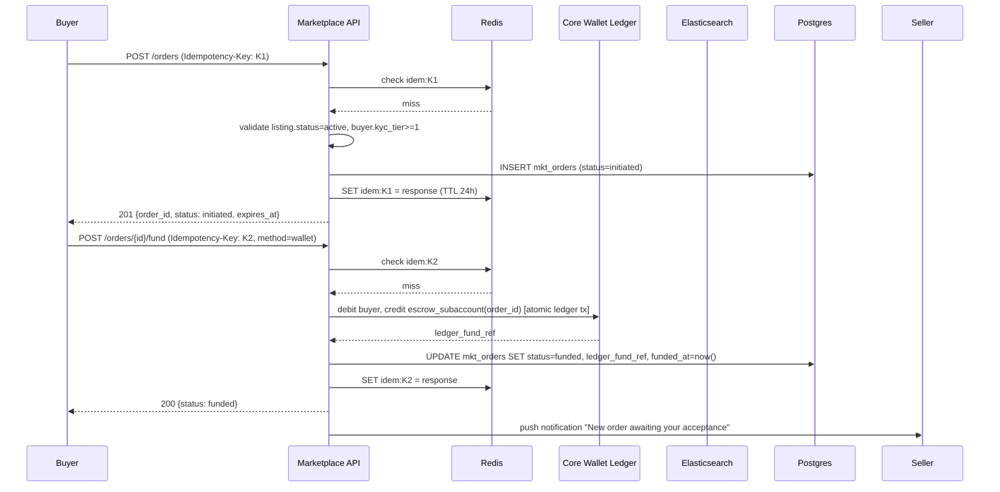
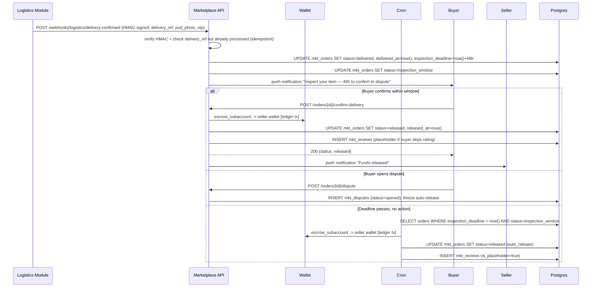
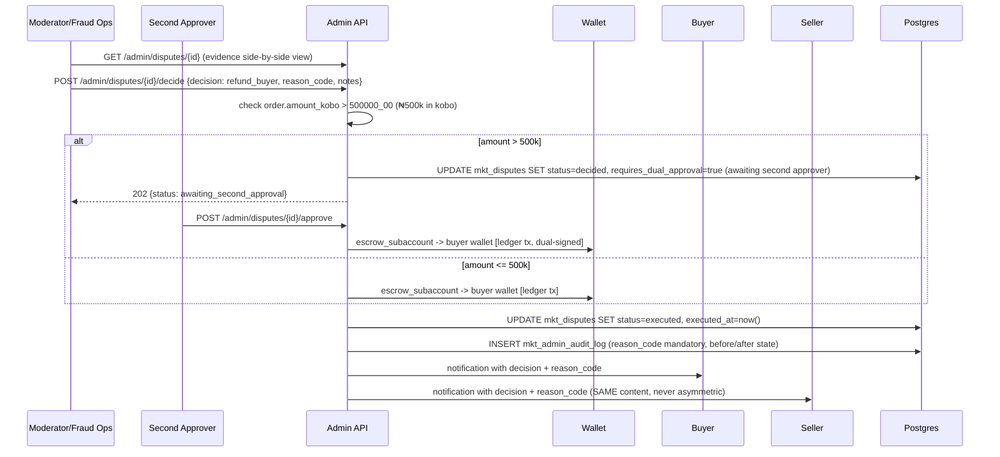

# PAYMAX MARKETPLACE — CLAUDE BUILD CONTRACT
## Engineering-ready specification for full-stack implementation
**This document is the build entrypoint. It assumes the product/architecture context in `Paymax_Marketplace_PRD_v4_MASTER.md`, `_v3_Feature_Gap_Addendum.md`, and `Jiji_Research_Dossier_and_PRD_v2.md` (same project) as background — read those for *why*; this document is for *how*, and is written to be sufficient on its own for implementation. Where a pattern repeats (e.g., 30+ API endpoints, 34 mobile screens), one fully-specified exemplar is given per category plus a template — extrapolate the remainder following the exemplar exactly, do not invent new conventions.**

**Brownfield conventions to inherit from the existing Paymax codebase (non-negotiable, per house doctrine):**
- Go/Chi backend, modular monolith — this ships as `modules/marketplace/`, own schema, no cross-module table writes.
- Append-only wallet ledger with derived balances — the marketplace **never** stores a balance; every money movement is a ledger transaction reference.
- Guarded state machines with structurally unreachable illegal states.
- Idempotency-Key required on every money-touching endpoint (24h dedupe window).
- Object-level authorization (OLA) on every endpoint — no exceptions.
- Immutable audit trail on every admin action.
- Offline-first mobile (React Native), existing design system components reused wherever a screen is a "thin skin."
- `market_id` as a first-class column/index-suffix everywhere, from the first migration (SaaS multi-market readiness).

---

# SECTION 1 — DATABASE SCHEMA (schema.sql)

```sql
-- ============================================================
-- PAYMAX MARKETPLACE MODULE — SCHEMA v1
-- Postgres 15+. All monetary values in kobo (integer, no floats).
-- All tables carry market_id for SaaS multi-tenancy from day one.
-- ============================================================

CREATE TYPE listing_status AS ENUM (
  'draft','pending_review','active','paused','expired','sold',
  'removed_policy','removed_user'
);

CREATE TYPE order_status AS ENUM (
  'initiated','funded','seller_accepted','in_delivery','delivered',
  'inspection_window','released','cancelled','disputed','refunded','split_settled'
);

CREATE TYPE dispute_status AS ENUM (
  'opened','evidence_window','under_review','decided','executed','closed','appealed'
);

CREATE TYPE boost_status AS ENUM ('purchased','active','completed','rejected_with_reason','auto_refunded');

CREATE TYPE kyc_tier AS ENUM ('tier0_browse','tier1_buy','tier2_sell','tier3_business');

CREATE TABLE mkt_categories (
  id              UUID PRIMARY KEY DEFAULT gen_random_uuid(),
  market_id       TEXT NOT NULL,                -- e.g. 'NG'
  parent_id       UUID REFERENCES mkt_categories(id),
  slug            TEXT NOT NULL,
  name            TEXT NOT NULL,
  attribute_schema JSONB NOT NULL DEFAULT '{}', -- JSON-schema for category-specific attrs
  risk_tier       SMALLINT NOT NULL DEFAULT 0,  -- 0=low,1=medium,2=high (routes to human review)
  commission_bps  INTEGER NOT NULL DEFAULT 200, -- basis points, override per category
  is_active       BOOLEAN NOT NULL DEFAULT true,
  created_at      TIMESTAMPTZ NOT NULL DEFAULT now(),
  updated_at      TIMESTAMPTZ NOT NULL DEFAULT now(),
  UNIQUE(market_id, slug)
);
CREATE INDEX idx_categories_market_parent ON mkt_categories(market_id, parent_id);

CREATE TABLE mkt_listings (
  id              UUID PRIMARY KEY DEFAULT gen_random_uuid(),
  market_id       TEXT NOT NULL,
  seller_id       UUID NOT NULL,                -- FK to core users table (cross-module, no FK constraint)
  category_id     UUID NOT NULL REFERENCES mkt_categories(id),
  title           TEXT NOT NULL CHECK (char_length(title) BETWEEN 10 AND 100),
  description     TEXT NOT NULL,
  description_word_count INTEGER GENERATED ALWAYS AS (array_length(regexp_split_to_array(trim(description), '\s+'), 1)) STORED,
  price_kobo      BIGINT NOT NULL CHECK (price_kobo >= 0),
  currency        TEXT NOT NULL DEFAULT 'NGN',
  condition       TEXT NOT NULL DEFAULT 'used', -- 'new'|'used'|'foreign_used'|'local_used'|'refurbished'
  attrs           JSONB NOT NULL DEFAULT '{}',  -- validated against category.attribute_schema at write time
  status          listing_status NOT NULL DEFAULT 'draft',
  quality_score   NUMERIC(5,4) NOT NULL DEFAULT 0.5,
  escrow_eligible BOOLEAN NOT NULL DEFAULT true,
  geo             GEOGRAPHY(POINT, 4326),
  state           TEXT NOT NULL,
  lga             TEXT,
  view_count      BIGINT NOT NULL DEFAULT 0,    -- synced from Redis HLL every 60s
  save_count      BIGINT NOT NULL DEFAULT 0,
  moderation_reason_code TEXT,                  -- set on removed_policy; never null when rejected
  created_at      TIMESTAMPTZ NOT NULL DEFAULT now(),
  updated_at      TIMESTAMPTZ NOT NULL DEFAULT now(),
  expires_at      TIMESTAMPTZ NOT NULL DEFAULT (now() + interval '60 days'),
  sold_at         TIMESTAMPTZ,
  CONSTRAINT chk_min_words CHECK (description_word_count >= 8)
);
CREATE INDEX idx_listings_seller ON mkt_listings(seller_id, status);
CREATE INDEX idx_listings_market_category ON mkt_listings(market_id, category_id, status);
CREATE INDEX idx_listings_geo ON mkt_listings USING GIST(geo);
CREATE INDEX idx_listings_expires ON mkt_listings(expires_at) WHERE status = 'active';

-- Outbox table — CDC source for the Elasticsearch indexer worker
CREATE TABLE mkt_listings_outbox (
  id              BIGSERIAL PRIMARY KEY,
  listing_id      UUID NOT NULL REFERENCES mkt_listings(id),
  op              TEXT NOT NULL,                -- 'upsert'|'delete'
  payload         JSONB NOT NULL,
  processed_at    TIMESTAMPTZ,
  created_at      TIMESTAMPTZ NOT NULL DEFAULT now()
);
CREATE INDEX idx_outbox_unprocessed ON mkt_listings_outbox(created_at) WHERE processed_at IS NULL;

CREATE TABLE mkt_listing_media (
  id              UUID PRIMARY KEY DEFAULT gen_random_uuid(),
  listing_id      UUID NOT NULL REFERENCES mkt_listings(id) ON DELETE CASCADE,
  url_thumb       TEXT NOT NULL,
  url_card        TEXT NOT NULL,
  url_full        TEXT NOT NULL,
  blurhash        TEXT NOT NULL,
  perceptual_hash TEXT NOT NULL,                -- for duplicate/stolen-photo detection
  sort_order      SMALLINT NOT NULL DEFAULT 0,
  created_at      TIMESTAMPTZ NOT NULL DEFAULT now()
);
CREATE INDEX idx_media_phash ON mkt_listing_media(perceptual_hash);

CREATE TABLE mkt_offers (
  id              UUID PRIMARY KEY DEFAULT gen_random_uuid(),
  listing_id      UUID NOT NULL REFERENCES mkt_listings(id),
  buyer_id        UUID NOT NULL,
  offer_price_kobo BIGINT NOT NULL CHECK (offer_price_kobo > 0),
  status          TEXT NOT NULL DEFAULT 'pending', -- 'pending'|'accepted'|'declined'|'countered'|'expired'
  parent_offer_id UUID REFERENCES mkt_offers(id), -- for counter-offer chains
  created_at      TIMESTAMPTZ NOT NULL DEFAULT now(),
  expires_at      TIMESTAMPTZ NOT NULL DEFAULT (now() + interval '48 hours')
);
CREATE INDEX idx_offers_listing ON mkt_offers(listing_id, status);

CREATE TABLE mkt_orders (
  id                    UUID PRIMARY KEY DEFAULT gen_random_uuid(),
  market_id             TEXT NOT NULL,
  listing_id            UUID NOT NULL REFERENCES mkt_listings(id),
  buyer_id              UUID NOT NULL,
  seller_id             UUID NOT NULL,
  offer_id              UUID REFERENCES mkt_offers(id),
  amount_kobo           BIGINT NOT NULL CHECK (amount_kobo > 0),
  escrow_fee_kobo       BIGINT NOT NULL,
  delivery_fee_kobo     BIGINT NOT NULL DEFAULT 0,
  status                order_status NOT NULL DEFAULT 'initiated',
  ledger_fund_ref       TEXT,                   -- reference into core wallet ledger (funding tx)
  ledger_release_ref    TEXT,                   -- reference into core wallet ledger (release tx)
  delivery_ref          TEXT,                   -- reference into logistics module
  pod_photo_url         TEXT,
  pod_otp_confirmed_at  TIMESTAMPTZ,
  inspection_deadline   TIMESTAMPTZ,             -- delivered_at + 48h
  idempotency_key       TEXT NOT NULL UNIQUE,
  created_at            TIMESTAMPTZ NOT NULL DEFAULT now(),
  updated_at            TIMESTAMPTZ NOT NULL DEFAULT now(),
  funded_at             TIMESTAMPTZ,
  delivered_at          TIMESTAMPTZ,
  released_at           TIMESTAMPTZ,
  cancelled_at          TIMESTAMPTZ
);
CREATE INDEX idx_orders_buyer ON mkt_orders(buyer_id, status);
CREATE INDEX idx_orders_seller ON mkt_orders(seller_id, status);
CREATE INDEX idx_orders_inspection_deadline ON mkt_orders(inspection_deadline) WHERE status = 'inspection_window';

CREATE TABLE mkt_disputes (
  id              UUID PRIMARY KEY DEFAULT gen_random_uuid(),
  order_id        UUID NOT NULL REFERENCES mkt_orders(id),
  opened_by       UUID NOT NULL,                -- buyer_id or seller_id
  reason_code     TEXT NOT NULL,
  status          dispute_status NOT NULL DEFAULT 'opened',
  decision        TEXT,                         -- 'refund_buyer'|'release_seller'|'split'
  decision_notes  TEXT,
  decided_by      UUID,                         -- admin user id
  requires_dual_approval BOOLEAN NOT NULL DEFAULT false, -- true when order.amount_kobo > 50000000 (₦500k)
  second_approver_id UUID,
  evidence_deadline TIMESTAMPTZ NOT NULL DEFAULT (now() + interval '72 hours'),
  created_at      TIMESTAMPTZ NOT NULL DEFAULT now(),
  decided_at      TIMESTAMPTZ,
  executed_at     TIMESTAMPTZ
);
CREATE INDEX idx_disputes_order ON mkt_disputes(order_id);
CREATE INDEX idx_disputes_aging ON mkt_disputes(created_at) WHERE status NOT IN ('closed','executed');

CREATE TABLE mkt_dispute_evidence (
  id              UUID PRIMARY KEY DEFAULT gen_random_uuid(),
  dispute_id      UUID NOT NULL REFERENCES mkt_disputes(id) ON DELETE CASCADE,
  submitted_by    UUID NOT NULL,
  evidence_type   TEXT NOT NULL,                -- 'photo'|'chat_excerpt'|'document'
  url_or_text     TEXT NOT NULL,
  created_at      TIMESTAMPTZ NOT NULL DEFAULT now()
);

-- REVIEW INTEGRITY: this table's existence is enforced by application logic, not just schema —
-- any order reaching 'released' MUST have a row inserted here (system-generated placeholder if
-- the buyer never submits one) so the count is never silently absent from a seller's profile.
CREATE TABLE mkt_reviews (
  id              UUID PRIMARY KEY DEFAULT gen_random_uuid(),
  order_id        UUID NOT NULL UNIQUE REFERENCES mkt_orders(id), -- UNIQUE enforces transaction-gating
  reviewer_id     UUID NOT NULL,
  reviewee_id     UUID NOT NULL,
  rating          SMALLINT CHECK (rating BETWEEN 1 AND 5), -- nullable if buyer never rates (system placeholder)
  comment         TEXT,
  seller_reply    TEXT,
  is_placeholder  BOOLEAN NOT NULL DEFAULT false, -- true if system-generated because buyer didn't review
  moderation_state TEXT NOT NULL DEFAULT 'visible', -- 'visible'|'under_review' — NEVER 'hidden'/'deleted'
  moderation_reason_code TEXT,
  moderated_by    UUID,
  created_at      TIMESTAMPTZ NOT NULL DEFAULT now()
);
CREATE INDEX idx_reviews_reviewee ON mkt_reviews(reviewee_id, moderation_state);

CREATE TABLE mkt_boosts (
  id              UUID PRIMARY KEY DEFAULT gen_random_uuid(),
  listing_id      UUID NOT NULL REFERENCES mkt_listings(id),
  seller_id       UUID NOT NULL,
  tier            TEXT NOT NULL,                -- 'start'|'vip'|'vip_gold'|'diamond'|'enterprise'
  duration_days   INTEGER NOT NULL,
  price_kobo      BIGINT NOT NULL,
  ledger_charge_ref TEXT NOT NULL,               -- wallet-native spend, no separate ad balance
  status          boost_status NOT NULL DEFAULT 'purchased',
  rejection_reason_code TEXT,
  refund_ref      TEXT,
  starts_at       TIMESTAMPTZ,
  ends_at         TIMESTAMPTZ,
  created_at      TIMESTAMPTZ NOT NULL DEFAULT now()
);
CREATE INDEX idx_boosts_active ON mkt_boosts(listing_id) WHERE status = 'active';

CREATE TABLE mkt_saved_searches (
  id              UUID PRIMARY KEY DEFAULT gen_random_uuid(),
  user_id         UUID NOT NULL,
  market_id       TEXT NOT NULL,
  query           TEXT,
  filters         JSONB NOT NULL DEFAULT '{}',
  alert_enabled   BOOLEAN NOT NULL DEFAULT true,
  last_notified_at TIMESTAMPTZ,
  created_at      TIMESTAMPTZ NOT NULL DEFAULT now()
);
CREATE INDEX idx_saved_searches_user ON mkt_saved_searches(user_id);

CREATE TABLE mkt_trust_scores (
  user_id         UUID PRIMARY KEY,
  market_id       TEXT NOT NULL,
  kyc_tier        kyc_tier NOT NULL DEFAULT 'tier0_browse',
  verified_id_badge BOOLEAN NOT NULL DEFAULT false,   -- PERMANENT once true; never toggled by payment status
  verified_business_badge BOOLEAN NOT NULL DEFAULT false,
  completed_escrow_count INTEGER NOT NULL DEFAULT 0,
  dispute_count   INTEGER NOT NULL DEFAULT 0,
  avg_response_minutes INTEGER,
  account_created_at TIMESTAMPTZ NOT NULL,
  trust_score     NUMERIC(5,4) NOT NULL DEFAULT 0.5, -- recomputed nightly, explainable via breakdown view
  updated_at      TIMESTAMPTZ NOT NULL DEFAULT now()
);

CREATE TABLE mkt_flags (
  id              UUID PRIMARY KEY DEFAULT gen_random_uuid(),
  target_type     TEXT NOT NULL,                -- 'listing'|'user'|'review'|'chat_message'
  target_id       UUID NOT NULL,
  reporter_id     UUID NOT NULL,
  reason_code     TEXT NOT NULL,
  notes           TEXT,
  status          TEXT NOT NULL DEFAULT 'open',  -- 'open'|'actioned'|'dismissed'
  reviewed_by     UUID,
  created_at      TIMESTAMPTZ NOT NULL DEFAULT now(),
  reviewed_at     TIMESTAMPTZ
);
CREATE INDEX idx_flags_open ON mkt_flags(status, created_at) WHERE status = 'open';

CREATE TABLE mkt_price_bands (
  id              UUID PRIMARY KEY DEFAULT gen_random_uuid(),
  market_id       TEXT NOT NULL,
  category_id     UUID NOT NULL REFERENCES mkt_categories(id),
  attrs_fingerprint TEXT NOT NULL,               -- hash of the attribute combination this band covers
  p25_kobo        BIGINT NOT NULL,
  p50_kobo        BIGINT NOT NULL,
  p75_kobo        BIGINT NOT NULL,
  sample_size     INTEGER NOT NULL,
  computed_at     TIMESTAMPTZ NOT NULL DEFAULT now(),
  UNIQUE(market_id, category_id, attrs_fingerprint)
);

-- Admin audit log — append-only, never updated or deleted
CREATE TABLE mkt_admin_audit_log (
  id              BIGSERIAL PRIMARY KEY,
  admin_id        UUID NOT NULL,
  admin_role      TEXT NOT NULL,
  action          TEXT NOT NULL,
  target_type     TEXT NOT NULL,
  target_id       UUID NOT NULL,
  reason_code     TEXT NOT NULL,                 -- mandatory on every state-changing action
  before_state    JSONB,
  after_state     JSONB,
  created_at      TIMESTAMPTZ NOT NULL DEFAULT now()
);
CREATE INDEX idx_audit_target ON mkt_admin_audit_log(target_type, target_id);
CREATE INDEX idx_audit_admin ON mkt_admin_audit_log(admin_id, created_at);
```

---

# SECTION 2 — STATE MACHINE TRANSITION TABLES

## 2.1 Listing FSM

| Current state | Event | Guard | Side effect | Next state |
|---|---|---|---|---|
| — | `create_draft` | none | insert row, `status=draft` | `draft` |
| `draft` | `submit` | description ≥8 words AND photo count ≥ category min AND price within 3x of `mkt_price_bands` p75 | if `category.risk_tier=0` AND seller `trust_score`≥0.6 → auto-approve; else enqueue to `mkt_flags`-style review queue | `pending_review` (or directly `active` if auto-approved) |
| `pending_review` | `approve` | admin action, reason_code optional (approval doesn't require one) | insert outbox row (op=upsert) | `active` |
| `pending_review` | `reject` | admin action, **reason_code MANDATORY** | notify seller with reason_code verbatim; insert outbox row (op=delete) | `removed_policy` |
| `active` | `pause` | seller-initiated | remove from ES via outbox delete | `paused` |
| `paused` | `resume` | seller-initiated, listing not expired | insert outbox upsert | `active` |
| `active` | `auto_expire` | `expires_at < now()`, cron job | insert outbox delete | `expired` |
| `expired` | `renew` | seller-initiated, one-tap | `expires_at = now()+60d`, outbox upsert | `active` |
| `active` | `mark_sold_via_escrow` | linked `mkt_orders.status='released'` | `sold_at=now()`, outbox delete | `sold` |
| `active` | `mark_sold_attestation` | seller-initiated, no escrow order | weighted lower in trust scoring than escrow-verified sale | `sold` |
| any | `user_delete` | owner-initiated | outbox delete | `removed_user` |

## 2.2 Escrow Order FSM (the critical path — every transition is a ledger-touching or delivery-touching event)

| Current state | Event | Guard | Side effect | Next state |
|---|---|---|---|---|
| — | `create_order` | listing.status=active AND listing.escrow_eligible AND buyer.kyc_tier≥tier1 | insert row with `Idempotency-Key` | `initiated` |
| `initiated` | `fund` | Idempotency-Key not seen in last 24h; buyer wallet balance ≥ amount+fee | **ledger tx: debit buyer wallet → credit order escrow sub-account**; store `ledger_fund_ref` | `funded` |
| `initiated` | `fund_timeout` | no funding event within 30 min | none | `cancelled` |
| `funded` | `seller_accept` | seller-initiated within 24h | dispatch delivery request to logistics module | `seller_accepted` |
| `funded` | `seller_reject_or_timeout` | seller declines OR 24h elapses | **ledger tx: refund escrow sub-account → buyer wallet** | `cancelled` |
| `seller_accepted` | `dispatch` | logistics module confirms rider assignment | `delivery_ref` populated | `in_delivery` |
| `in_delivery` | `deliver` | POD photo + OTP confirmed via logistics webhook (HMAC-verified, idempotent) | `delivered_at=now()`, `inspection_deadline = now()+48h` | `delivered` → immediately `inspection_window` |
| `inspection_window` | `buyer_confirm` | buyer-initiated, before `inspection_deadline` | **ledger tx: escrow sub-account → seller wallet**, minus platform fee | `released` |
| `inspection_window` | `auto_release` | cron: `inspection_deadline < now()` AND no open dispute | same ledger tx as above | `released` |
| `inspection_window` | `open_dispute` | buyer or seller-initiated, before release | freezes auto-release clock; creates `mkt_disputes` row | `disputed` |
| `disputed` | `resolve_refund` | admin decision, dual-approval if amount>₦500k | **ledger tx: escrow sub-account → buyer wallet** | `refunded` |
| `disputed` | `resolve_release` | admin decision, dual-approval if amount>₦500k | **ledger tx: escrow sub-account → seller wallet** | `released` |
| `disputed` | `resolve_split` | admin decision, dual-approval if amount>₦500k | **two ledger tx**: partial to each party | `split_settled` |

**Non-negotiable invariant:** every terminal state (`released`, `refunded`, `cancelled`, `split_settled`) MUST correspond to exactly one balanced ledger posting. No transition may leave funds in the escrow sub-account with no forward path. Reconciliation job runs hourly checking `SUM(escrow_sub_account_balance) = SUM(orders WHERE status IN ('funded','seller_accepted','in_delivery','delivered','inspection_window','disputed'))`.

## 2.3 Dispute FSM

| Current state | Event | Guard | Side effect | Next state |
|---|---|---|---|---|
| — | `open` | linked order in `inspection_window` | freeze order's auto-release | `opened` |
| `opened` | `start_evidence_window` | automatic on open | `evidence_deadline = now()+72h` | `evidence_window` |
| `evidence_window` | `evidence_deadline_passed` | cron | routes to admin queue | `under_review` |
| `under_review` | `decide` | admin action, **reason_code mandatory**, dual-approval if order amount > ₦500k | executes ledger transaction per §2.2 | `decided` → `executed` |
| `executed` | `close` | automatic | notify both parties identically with decision + reason | `closed` |
| `closed` | `appeal` | either party, once only, within 7 days | reopens to `under_review` with `requires_dual_approval=true` regardless of amount | `appealed` |

## 2.4 Boost FSM

| Current state | Event | Guard | Side effect | Next state |
|---|---|---|---|---|
| — | `purchase` | wallet balance ≥ price_kobo | **ledger tx: debit seller wallet directly** (no separate ad-balance) | `purchased` |
| `purchased` | `activate` | automatic on purchase | `starts_at=now()`, boost_weight applied in ES function_score | `active` |
| `active` | `complete` | `ends_at < now()` | boost_weight removed | `completed` |
| `active` or `purchased` | `reject` | admin/system detects policy violation, **reason_code mandatory** | **automatic refund ledger tx**, notify seller with exact reason_code | `rejected_with_reason` → `auto_refunded` |

---

# SECTION 3 — API CONTRACTS (OpenAPI-style, exemplars + extrapolation template)

**Global conventions for every endpoint below and every endpoint not explicitly listed:**
- Base path: `/v1/marketplace`
- Auth: `Authorization: Bearer {jwt}` (existing Paymax auth), scoped by OLA to the resource owner or admin role.
- Idempotency: `Idempotency-Key` header **required** on all `POST`/`PUT` that touch money (order creation, funding, release, boost purchase, dispute decision). 24h dedupe window in Redis.
- Pagination: `?cursor={opaque}&limit={1-50, default 20}`, response includes `next_cursor`.
- Error shape (uniform across all endpoints):
```json
{
  "error": {
    "code": "LISTING_NOT_ESCROW_ELIGIBLE",
    "message": "This listing does not support escrow checkout.",
    "field": null,
    "request_id": "req_01HXYZ..."
  }
}
```
- Standard HTTP codes: 200/201 success, 400 validation, 401 unauth, 403 OLA violation, 404 not found, 409 conflict/idempotency replay, 422 business-rule rejection, 429 rate-limited, 500 unexpected.

### 3.1 Exemplar — Create Escrow Order (the highest-risk endpoint in the system)

```yaml
POST /v1/marketplace/orders
headers:
  Authorization: Bearer {jwt}
  Idempotency-Key: {uuid, required}
request_body:
  listing_id: uuid, required
  offer_id: uuid, optional (if buying at negotiated price)
  delivery_option: enum[pickup, rider_delivery], required
response_201:
  id: uuid
  status: "initiated"
  amount_kobo: integer
  escrow_fee_kobo: integer
  delivery_fee_kobo: integer
  total_payable_kobo: integer
  expires_at: iso8601   # 30-min funding window
errors:
  400: LISTING_NOT_FOUND | INVALID_DELIVERY_OPTION
  403: BUYER_KYC_TIER_INSUFFICIENT   # buyer must be >= tier1
  409: IDEMPOTENCY_KEY_REPLAY (returns original 201 response body, not an error)
  422: LISTING_NOT_ACTIVE | LISTING_NOT_ESCROW_ELIGIBLE | SELF_PURCHASE_NOT_ALLOWED
```

```yaml
POST /v1/marketplace/orders/{id}/fund
headers:
  Authorization: Bearer {jwt}
  Idempotency-Key: {uuid, required}
request_body:
  payment_method: enum[wallet, card, bank_transfer], required
  # if card/bank_transfer: delegates to existing Paymax payment-gateway module, callback webhook confirms funding
response_200:
  id: uuid
  status: "funded"
  ledger_fund_ref: string
errors:
  402: INSUFFICIENT_WALLET_BALANCE
  409: ORDER_ALREADY_FUNDED (idempotent replay) | ORDER_EXPIRED
  422: ORDER_NOT_IN_INITIATED_STATE
```

```yaml
POST /v1/marketplace/orders/{id}/confirm-delivery
headers:
  Authorization: Bearer {jwt}
request_body: {}   # buyer-initiated, no body needed
response_200:
  id: uuid
  status: "released"
  ledger_release_ref: string
errors:
  403: NOT_ORDER_BUYER
  422: ORDER_NOT_IN_INSPECTION_WINDOW | INSPECTION_DEADLINE_PASSED (already auto-released)
```

```yaml
POST /v1/marketplace/orders/{id}/dispute
headers:
  Authorization: Bearer {jwt}
  Idempotency-Key: {uuid, required}
request_body:
  reason_code: enum[item_not_as_described, item_not_received, item_damaged, counterfeit, other], required
  description: string, max 1000 chars
  evidence: array of {type: enum[photo,chat_excerpt,document], url_or_text: string}
response_201:
  id: uuid  # dispute id
  status: "opened"
  evidence_deadline: iso8601
errors:
  403: NOT_ORDER_PARTY
  409: DISPUTE_ALREADY_OPEN_FOR_ORDER
  422: ORDER_NOT_DISPUTABLE  # e.g. already released, no dispute window left
```

### 3.2 Exemplar — Listings

```yaml
POST /v1/marketplace/listings
request_body:
  category_id: uuid, required
  title: string, 10-100 chars, required
  description: string, min 8 words (validated server-side as final gate; client validates first per BL-04), required
  price_kobo: integer, required
  condition: enum[new, used, foreign_used, local_used, refurbished], required
  attrs: object, required — validated against category.attribute_schema (draft-07 JSON Schema)
  media_ids: array of uuid, required, min count enforced per category (e.g. 3 for vehicles/phones)
  state: string, required
  lga: string, optional
  geo: {lat: float, lng: float}, optional
  escrow_eligible: boolean, default true
response_201:
  id: uuid
  status: "pending_review" | "active"   # depends on auto-approval guard
errors:
  400: SCHEMA_VALIDATION_FAILED (field-level errors array included)
  422: DESCRIPTION_TOO_SHORT | INSUFFICIENT_PHOTOS | PRICE_OUT_OF_BAND | DUPLICATE_PHOTO_DETECTED
```

```yaml
GET /v1/marketplace/listings/{id}
response_200:
  id, seller: {id, trust_score, verified_id_badge, verified_business_badge, tenure_label, response_time_minutes}
  category, title, description, price_kobo, condition, attrs, media: [...], status
  fair_price_band: {p25_kobo, p50_kobo, p75_kobo} | null
  escrow_eligible, view_count, save_count
  similar_listing_ids: array of uuid
```

```yaml
GET /v1/marketplace/search
query_params:
  q: string, optional
  category_id: uuid, optional
  price_min, price_max: integer, optional
  condition: enum, optional
  lat, lng, radius_km: optional
  state, lga: optional
  sort: enum[relevance, price_asc, price_desc, newest, trusted_first], default relevance
  cursor, limit
response_200:
  results: array of listing summary objects
  facets: {categories: [...], conditions: [...], price_ranges: [...]}
  next_cursor: string | null
  took_ms: integer   # for the p95<250ms budget monitoring
```

### 3.3 Remaining endpoints — extrapolate from the exemplars above using this table

| Resource | Endpoints (follow exemplar conventions exactly) |
|---|---|
| Offers | `POST /offers`, `POST /offers/{id}/accept`, `POST /offers/{id}/counter`, `POST /offers/{id}/decline` |
| Orders (remainder) | `GET /orders/{id}`, `GET /orders?role=buyer\|seller&status=`, `POST /orders/{id}/accept` (seller), `POST /orders/{id}/cancel` |
| Disputes (remainder) | `GET /disputes/{id}`, `POST /disputes/{id}/evidence`, `POST /disputes/{id}/appeal` |
| Reviews | `POST /orders/{id}/review` (only callable when order.status=released), `POST /reviews/{id}/reply` (seller), `POST /reviews/{id}/appeal` |
| Boosts | `GET /boosts/tiers`, `POST /boosts` (charges wallet directly per §2.4), `GET /boosts/{id}` |
| Saved searches | `POST /saved-searches`, `GET /saved-searches`, `DELETE /saved-searches/{id}`, `PATCH /saved-searches/{id}` (toggle alert) |
| Sellers | `GET /sellers/{id}/profile`, `GET /sellers/{id}/listings`, `GET /sellers/{id}/reviews` |
| Verification | `POST /verification/id` (delegates to existing SmileID/Dojah adapter), `POST /verification/business` (CAC upload) |
| Bulk (Tier-3 only) | `POST /listings/bulk` (CSV or JSON array, max 500/request, async job returns a job_id, `GET /listings/bulk/{job_id}` for status) |
| Webhooks (inbound) | `POST /webhooks/logistics/delivery-confirmed` (HMAC-signed, idempotent on delivery_ref), `POST /webhooks/payments/funding-confirmed` (HMAC-signed, idempotent on ledger_fund_ref) |
| Admin — all modules M1-M8 | `GET/POST /admin/{module}/...` — every mutating admin endpoint requires `reason_code` in the body and writes to `mkt_admin_audit_log` automatically via middleware, never optionally |

---

# SECTION 4 — ELASTICSEARCH MAPPING (es-mapping.json)

```json
{
  "index_patterns": ["mkt_listings_ng_v*"],
  "template": {
    "settings": {
      "number_of_shards": 3,
      "number_of_replicas": 1,
      "analysis": {
        "filter": {
          "edge_ngram_filter": { "type": "edge_ngram", "min_gram": 2, "max_gram": 15 },
          "ng_synonym_filter": {
            "type": "synonym",
            "synonyms_path": "analysis/ng_synonyms.txt"
          }
        },
        "analyzer": {
          "listing_index_analyzer": {
            "type": "custom",
            "tokenizer": "standard",
            "filter": ["lowercase", "ng_synonym_filter", "edge_ngram_filter"]
          },
          "listing_search_analyzer": {
            "type": "custom",
            "tokenizer": "standard",
            "filter": ["lowercase", "ng_synonym_filter"]
          }
        }
      }
    },
    "mappings": {
      "properties": {
        "listing_id":        { "type": "keyword" },
        "market_id":         { "type": "keyword" },
        "seller_id":         { "type": "keyword" },
        "category_id":       { "type": "keyword" },
        "category_path":     { "type": "keyword" },
        "title": {
          "type": "text",
          "analyzer": "listing_index_analyzer",
          "search_analyzer": "listing_search_analyzer"
        },
        "description": {
          "type": "text",
          "analyzer": "listing_index_analyzer",
          "search_analyzer": "listing_search_analyzer"
        },
        "attrs":             { "type": "flattened" },
        "price_kobo":        { "type": "long" },
        "condition":         { "type": "keyword" },
        "geo":               { "type": "geo_point" },
        "state":             { "type": "keyword" },
        "lga":               { "type": "keyword" },
        "seller_trust_score":{ "type": "float" },
        "quality_score":     { "type": "float" },
        "boost_weight":      { "type": "float" },
        "escrow_eligible":   { "type": "boolean" },
        "status":            { "type": "keyword" },
        "created_at":        { "type": "date" },
        "freshness_ts":      { "type": "date" }
      }
    }
  }
}
```

**Ranking query template (server constructs this per search request):**
```json
{
  "query": {
    "function_score": {
      "query": {
        "bool": {
          "must": [
            { "multi_match": {
                "query": "{{user_query}}",
                "fields": ["title^3", "description", "attrs.*"],
                "fuzziness": "AUTO"
            }}
          ],
          "filter": [
            { "term": { "status": "active" } },
            { "term": { "market_id": "{{market}}" } }
          ]
        }
      },
      "functions": [
        { "field_value_factor": { "field": "quality_score", "missing": 0.5 } },
        { "field_value_factor": { "field": "seller_trust_score", "missing": 0.5 } },
        { "gauss": { "geo": { "origin": "{{user_lat}},{{user_lng}}", "scale": "25km" } } },
        { "exp": { "freshness_ts": { "origin": "now", "scale": "30d" } } },
        { "field_value_factor": { "field": "boost_weight", "missing": 0, "modifier": "log1p", "factor": 1.0 } }
      ],
      "score_mode": "multiply",
      "boost_mode": "sum"
    }
  }
}
```
*(`boost_mode: sum` is deliberate — boost_weight is additive on top of the multiplied relevance/quality/trust/geo/freshness score, so it can never multiply its way to dominance. This is the literal implementation of "boosts add, never dominate.")*

---

# SECTION 5 — REDIS KEY REGISTRY

| Key pattern | Data type | TTL | Written by | Read by | Purpose |
|---|---|---|---|---|---|
| `srch:{market}:{hash}` | STRING (JSON) | 60s | search API | search API | Search results cache |
| `lst:{listing_id}` | STRING (JSON) | write-through, no TTL (invalidated on update) | listing update handler | listing detail API | Listing detail cache |
| `feed:{market}:{segment}` | STRING (JSON) | 120s | home feed job | home API | Home feed cache |
| `views:hll:{listing_id}` | HyperLogLog | 24h rolling | listing detail API (on view) | batch sync job (60s) | View counter, synced to Postgres |
| `ratelimit:listing-create:{user_id}` | STRING (counter) | 24h | listing create API | listing create API | Token-bucket rate limit |
| `ratelimit:first-msg:{user_id}` | STRING (counter) | 1h | chat API | chat API | Anti-spam throttle |
| `idem:{idempotency_key}` | STRING (JSON response) | 24h | all money-touching POST handlers | same | Idempotency replay |
| `priceband:{market}:{category_id}:{attrs_hash}` | HASH | 6h | nightly price-band job | price screen API, listing detail API | Fast fair-price lookup |
| `fraud:device:{device_fingerprint}` | SET (user_ids) | 30d | auth/session middleware | Trust & Fraud Desk (M3) | Ban-evasion device clustering |
| `chat:presence:{conversation_id}` | STRING (user_id + timestamp) | 60s | chat websocket handler | chat UI | Online/typing indicator |
| `pubsub:saved-search-match` | Pub/Sub channel (not a key) | n/a | ES indexer worker (on upsert) | notification dispatcher | Instant saved-search alert |

**Cluster topology:** Redis Cluster, 3 primary shards + 1 replica each, multi-AZ. Roles above are logically separated by key-prefix, not physically separated databases, to keep cross-role atomic operations (e.g., idempotency check + rate-limit check in one Lua script) possible.

---

# SECTION 6 — SEQUENCE DIAGRAMS (critical flows)

## 6.1 Escrow checkout → funding



## 6.2 Delivery confirmation → auto-release



## 6.3 Dispute resolution (dual-approval path)



---

# SECTION 7 — MOBILE SCREEN SPECS (exemplars per flow category + template)

**Template every screen spec must follow:**
```
### Screen N — Name
Purpose: [one line]
Entry points: [which screens link here]
Components: [design-system components used, new components needed flagged explicitly]
Data required: [API calls made on mount]
States: loading | empty | error | populated | [screen-specific states]
Primary action: [button/gesture → resulting API call → resulting navigation]
Secondary actions: [...]
Analytics events fired: [event_name: {props}]
```

### Screen 6 — Listing Detail (exemplar: Discovery)
Purpose: Show full listing info and drive to escrow checkout or chat.
Entry points: Search results, Home rails, Saved items, deep link (share), Seller Profile.
Components: `ImageGallery` (existing, extend with BlurHash placeholder support), `TrustBadgeRow` (new), `FairPriceChip` (new), `PrimaryCTAButton` (existing), `SimilarListingsRail` (existing pattern from Connect feed).
Data required: `GET /listings/{id}` on mount; `GET /sellers/{id}/profile` for trust card (can be embedded in listing response — prefer embedding to avoid a second round trip).
States: loading (skeleton), error (retry banner), populated, `listing_removed` (if seller deleted after buyer navigated here — show "no longer available" + similar items).
Primary action: "Buy with Escrow" button → `POST /orders` → navigate to Screen 21 (Escrow Checkout). Disabled state with tooltip if `escrow_eligible=false` or buyer `kyc_tier<1` (routes to Verification Center instead).
Secondary actions: "Chat" → navigate to Screen 19 (Deal Room, creates conversation if none exists); "Call" → revealed only after first chat message sent (anti-scraping); "Save" → `POST /saved-searches` equivalent heart-toggle; "Report" → Screen 31.
Analytics events fired: `listing_viewed: {listing_id, category_id, price_kobo, source_screen}`, `escrow_cta_tapped`, `chat_initiated_from_listing`.

### Screen 11 — Smart Composer (exemplar: Sell)
Purpose: Fast, camera-first listing creation with real-time validation (fixes Jiji's async-only rejection).
Entry points: Screen 10 (Sell entry).
Components: `CameraCapture` (existing), `AIPrefillBanner` (new — shows "Detected: iPhone 13, Phones & Tablets category" with accept/edit), `LiveValidationFooter` (new — word-count progress ring, photo-count checklist, duplicate-photo warning banner).
Data required: on photo capture, calls an internal AI classification endpoint (`POST /listings/classify-photo`) to prefill category/title/attrs suggestion; client-side runs word-count and photo-count checks locally against category minimums (fetched once via `GET /categories/{id}` schema, cached).
States: loading (AI classification in-flight, show shimmer on prefill fields), populated, `validation_failing` (submit button disabled, specific inline errors shown — never a generic "fix your ad").
Primary action: "Next" → advances to Screen 12 (Attribute form) only when all client-side checks pass.
Analytics events fired: `composer_photo_captured`, `ai_prefill_accepted` / `ai_prefill_edited`, `validation_error_shown: {error_type}`.

### Screen 21 — Escrow Checkout (exemplar: Transact)
Purpose: Fund the order into escrow with full fee transparency.
Entry points: Screen 6 (Listing Detail "Buy with Escrow"), Screen 19 (Deal Room after offer accepted).
Components: `FeeBreakdownCard` (new — item price / escrow fee / delivery fee / total, each line labeled), `PaymentMethodSelector` (existing, from core wallet module), `EscrowExplainerSheet` (new, dismissible, "How escrow protects you" — shown once per user, then collapsible).
Data required: order already created (`POST /orders` called from previous screen); this screen calls `POST /orders/{id}/fund` on confirm.
States: loading, `insufficient_balance` (deep-links to wallet top-up flow, returns here after), `funding_in_progress` (for card/bank_transfer methods awaiting webhook confirmation — poll or websocket), `funded` (auto-navigates to Screen 22).
Primary action: "Fund Escrow — ₦{total}" → `POST /orders/{id}/fund` with chosen payment_method and a client-generated `Idempotency-Key` (persisted locally so a retry after app-kill reuses the same key).
Analytics events fired: `checkout_viewed: {order_id, amount_kobo}`, `funding_method_selected`, `funding_succeeded` / `funding_failed: {error_code}`.

### Screen 24 — Dispute Wizard (exemplar: Transact/Trust)
Purpose: Structured, evidence-gathering dispute filing — never a free-text-only complaint.
Entry points: Screen 23 (Inspect & Confirm "Something's wrong").
Components: `ReasonCodeSelector` (new — the enum list from §3.1, radio buttons not free text, though a description field follows), `EvidenceUploader` (existing media-upload component, repurposed), `TimelineExpectationCard` (new — static content explaining the 72h evidence window and decision process, sourced from Admin M8 CMS so it can be updated without an app release).
Data required: `POST /orders/{id}/dispute` on submit.
States: loading, `submitted` (shows evidence_deadline countdown, links to Screen 25).
Primary action: "Submit Dispute" → creates dispute, freezes the order's auto-release clock server-side, navigates to Screen 25.
Analytics events fired: `dispute_opened: {order_id, reason_code}`.

**Remaining 30 screens:** follow the template above. Screens that are "thin skins over existing Paymax components" (Wallet hand-off, Verification Center reusing KYC flows, Report flow reusing existing moderation UI patterns) should have their spec written as a **diff** against the existing component ("same as existing KYC selfie-capture screen, add a 'Verification for Marketplace Selling' header and a permanent-badge explainer footer") rather than a full re-spec — do not rebuild what already exists.

---

# SECTION 8 — ERROR TAXONOMY & EDGE CASES

| Scenario | Handling |
|---|---|
| Payment gateway timeout mid-checkout (card/bank_transfer) | Order stays `initiated`, never silently marked `funded`. Client polls `GET /orders/{id}` or listens on websocket; gateway webhook is the only source of truth for `funded` transition. If webhook never arrives within 30 min, order auto-cancels (§2.2 `fund_timeout`), buyer notified, no money was ever at risk since the ledger debit only happens on confirmed webhook receipt. |
| Duplicate webhook delivery (logistics POD, payment funding) | All inbound webhooks are HMAC-verified and idempotent on their natural key (`delivery_ref`, `ledger_fund_ref`/gateway transaction id) — a `UNIQUE` constraint or a Redis-backed dedupe check makes replays no-ops that return 200 without re-executing side effects. |
| Rider app offline during POD capture | Logistics module's own retry/offline-queue responsibility (outside this module's boundary) — marketplace module only consumes the eventual webhook; if delivery is never confirmed, order remains `in_delivery` indefinitely and surfaces on an admin aging dashboard (extend M7) for manual investigation after 72h. |
| Buyer disputes after auto-release already fired (race condition) | `inspection_deadline` check and the release cron are the same source of truth; `open_dispute` guard explicitly checks `status='inspection_window'` — if the cron won the race, the endpoint returns `422 ORDER_NOT_DISPUTABLE` with a message directing the buyer to the standard post-release complaint path (lower priority queue, no fund freeze, since funds have already moved — this is a deliberate, disclosed trade-off, not a bug). |
| Seller attempts to edit a listing that has an order `in_delivery` | Blocked — `PUT /listings/{id}` returns `409 LISTING_HAS_ACTIVE_ORDER` for price/core-attribute changes while any non-terminal order references it; photos/description typo fixes still allowed. |
| Two buyers attempt to order the same single-quantity listing simultaneously | First `POST /orders` to commit wins (DB-level optimistic lock on `listings.status`); second request gets `422 LISTING_NOT_ACTIVE` immediately, no ghost orders created. |
| Boost purchased on a listing that gets rejected by moderation afterward | Boost auto-transitions to `rejected_with_reason` → `auto_refunded` in the same transaction as the listing's `removed_policy` transition — never left dangling as "active" on a dead listing. |
| Review appeal filed by both parties simultaneously | Each appeal is its own row referencing the same review; admin resolves both in one action, and the outcome is written once and displayed identically to both — no scenario produces two different stated outcomes. |
| KYC provider (SmileID/Dojah) outage during seller verification attempt | Verification request queues client-side with a visible "pending, will retry" state; the underlying badge-permanence rule (§ trust_scores) means a slow verification never regresses an *already-verified* seller's badge — only affects new verification attempts. |

---

# SECTION 9 — ANALYTICS EVENT SCHEMA (minimum required for launch)

| Event | Fired from | Key properties |
|---|---|---|
| `listing_created` | Smart Composer submit | listing_id, category_id, price_kobo, has_escrow_eligible |
| `listing_viewed` | Listing Detail mount | listing_id, source_screen, seller_trust_score |
| `search_performed` | Search/Results | query, filters, result_count, took_ms |
| `escrow_order_created` | Checkout flow | order_id, listing_id, amount_kobo |
| `escrow_order_funded` | Fund confirmation | order_id, payment_method |
| `escrow_order_released` | Release (manual or auto) | order_id, release_type[manual\|auto] |
| `dispute_opened` | Dispute Wizard | order_id, reason_code |
| `dispute_resolved` | Admin decision | dispute_id, decision, resolution_time_hours |
| `boost_purchased` | Boost purchase | listing_id, tier, price_kobo |
| `review_submitted` | Review Composer | order_id, rating, is_placeholder |
| `verification_badge_earned` | KYC completion | user_id, tier |
| `whatsapp_bridge_followed` | Deal Room external-link tap | conversation_id (used to measure P3's "continue safely" bridge effectiveness) |

All events flow through the existing Paymax analytics pipeline; no new infrastructure required, only new event names registered.

---

# SECTION 10 — BUILD ORDER FOR CLAUDE CODE

1. Run `schema.sql` (§1) as a new migration in `modules/marketplace/migrations/`.
2. Scaffold the Go/Chi module structure with the FSM guard tables from §2 implemented as explicit switch/guard functions per entity — no implicit state transitions anywhere in the codebase.
3. Implement the exemplar endpoints in §3.1/3.2 first (orders + listings are the critical path); extrapolate §3.3's remaining endpoints only after the exemplars pass their acceptance tests.
4. Stand up the Elasticsearch index template (§4) and the outbox-consuming indexer worker before any search endpoint is wired to the mobile app.
5. Wire the Redis key registry (§5) as a typed client wrapper (`marketplace/cache/keys.go`) — no raw string key construction scattered through business logic.
6. Implement the three sequence-diagram flows in §6 as integration tests first (they encode the system's non-negotiable invariants), then build the endpoints to satisfy them.
7. Build mobile screens in this order: Screens 10-14 (Sell flow) → 1-9 (Discovery) → 18-27 (Transact) → 28-34 (Trust & account) — sell-side first because a marketplace with nothing listed cannot be tested end-to-end.
8. Build Super Admin modules M1 (moderation) and M4 (disputes) before M5-M8 — nothing else can be operated safely without a moderation queue and a dispute workbench live.
9. Run the full §8 error-taxonomy scenarios as chaos/integration tests before Phase 1 ships.
10. Load-test search and checkout against the p95 budgets in the master PRD's §8 using k6, with the exact query and mutation patterns from §3, before declaring Phase 1 complete.
